# 知几（ZhiJi）- AI Agent 可行性评估平台产品需求文档（PRD）

## 1. 产品概述

### 1.1 产品名称与寓意

#### 产品名称：知几（ZhiJi）

**文化出处**：《易经·系辞下》"君子见几而作，不俟终日"

**寓意解析**：
- **"知"**：认知、了解、洞察
- **"几"**：事物的细微征兆、先机、苗头
- **整体含义**：能够察觉事物发展的细微征兆，洞察先机，在事情尚未明朗之前就能预见其发展趋势

**产品理念**：
"知几"体现了本产品的核心价值——帮助用户在AI Agent项目启动之初，就能洞察项目的可行性，预见潜在的成功与风险，真正做到"见几而作"，避免盲目投入。正如古人所言："几者，动之微，吉凶之先见者也。"我们的平台就是要帮助用户看到这些"微"的征兆。

**品牌口号**：洞察先机，预见成败

### 1.2 产品愿景
打造一个基于深厚文化底蕴和先进技术的AI Agent项目评估平台，让每一个AI创新者都能"知几而作"，在项目启动前就能准确判断可行性，提高成功率，避免资源浪费。

### 1.3 核心价值主张
- **降低试错成本**：在投入大量资源前识别不可行项目
- **科学决策支持**：基于实践总结的评估框架
- **可视化洞察**：直观展示项目在能力矩阵中的位置
- **专业指导建议**：提供具体的实施路径和改进方案

### 1.4 目标用户
- **主要用户**：AI产品经理、技术创业者、研发团队负责人
- **次要用户**：投资人、企业决策者、AI咨询顾问

## 2. 功能需求

### 2.1 核心功能模块

#### 2.1.1 智能评估引擎
```typescript
interface EvaluationEngine {
  // 输入：项目描述
  input: {
    projectName: string;
    description: string;
    targetUsers: string;
    expectedFeatures: string[];
    constraints?: string[];
  };
  
  // 输出：评估结果
  output: {
    totalScore: number;        // 0-100
    dimensions: DimensionScore[];
    matrixPosition: MatrixPosition;
    feasibility: 'highly-recommended' | 'cautious' | 'not-recommended';
    risks: Risk[];
    suggestions: Suggestion[];
    roi: ROIAnalysis;
  };
}
```

#### 2.1.2 能力矩阵可视化
- **动态SVG渲染**：实时在矩阵图中标注项目位置
- **区域识别**：自动识别项目所在区域（最大公约数/挑战/不可行等）
- **对比展示**：支持多个项目同时展示对比
- **交互功能**：鼠标悬停显示详细信息

#### 2.1.3 评估报告生成
- **专业报告**：生成PDF/Markdown格式的详细报告
- **执行摘要**：一页纸的关键信息总结
- **分享功能**：生成可分享的链接

### 2.2 评估维度详解

| 维度 | 权重 | 评估标准 | 数据来源 |
|------|------|----------|----------|
| **任务定义清晰度** | 25% | • 输入输出明确性<br>• 边界清晰度<br>• 标准化程度 | 用户输入分析 |
| **LLM能力匹配度** | 25% | • 技术成熟度<br>• 模型适配性<br>• 性能要求 | 内置知识库 |
| **评估标准客观性** | 20% | • 成功指标量化<br>• 验收标准明确<br>• 质量可衡量 | 规则引擎 |
| **样例数据充足性** | 15% | • 训练数据可得<br>• 测试样例充分<br>• 数据质量 | 用户确认 |
| **失败容错成本** | 15% | • 错误影响范围<br>• 补救机制完备<br>• 用户容忍度 | 风险评估 |

## 3. 技术架构

### 3.1 技术栈
```yaml
前端:
  - 框架: Next.js 14 (App Router)
  - 语言: TypeScript 5.x
  - 样式: Tailwind CSS 3.x
  - 组件库: shadcn/ui
  - 状态管理: Zustand
  - 表单: React Hook Form + Zod
  - 图表: D3.js / React SVG

后端与基础设施 (Cloudflare生态):
  - 部署平台: Cloudflare Pages
  - API服务: Cloudflare Workers
  - 数据库: Cloudflare D1 (SQLite)
  - KV存储: Cloudflare KV (缓存)
  - 对象存储: Cloudflare R2
  - 队列服务: Cloudflare Queues
  - WebSocket: Cloudflare Durable Objects
  - AI服务: OpenAI API / Claude API
  - 认证: NextAuth.js + Cloudflare Zero Trust

性能与安全:
  - CDN: Cloudflare全球网络
  - DDoS防护: Cloudflare自动防护
  - WAF: Cloudflare Web应用防火墙
  - 分析: Cloudflare Analytics
  - 边缘计算: Workers边缘函数
```

### 3.2 系统架构图（基于Cloudflare）

#### 整体架构概览
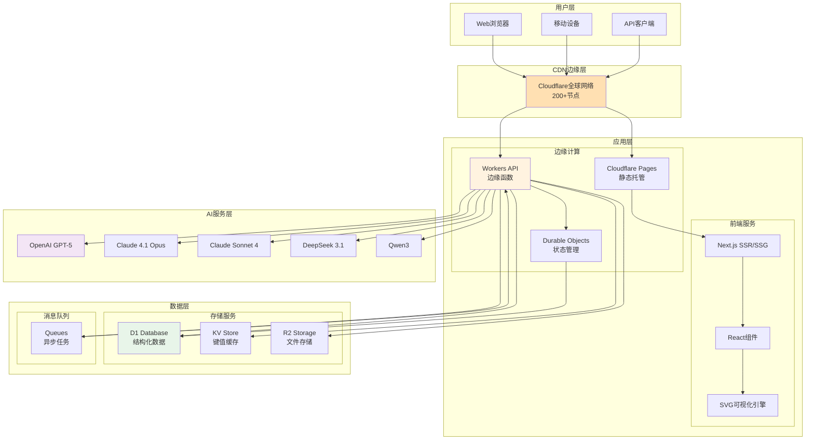

#### 微服务架构分层
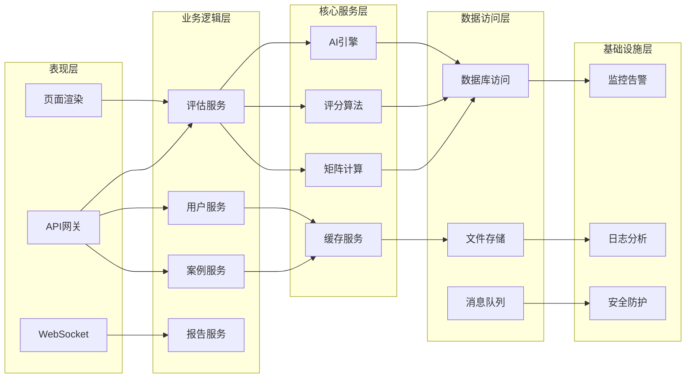

### 3.3 业务流程图

#### 用户评估流程
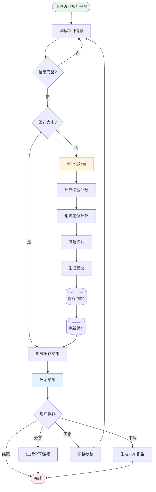

#### 数据处理流程
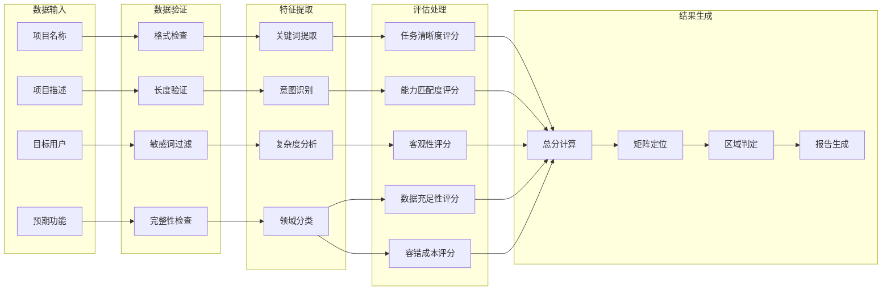

### 3.4 时序图

#### 评估请求处理时序
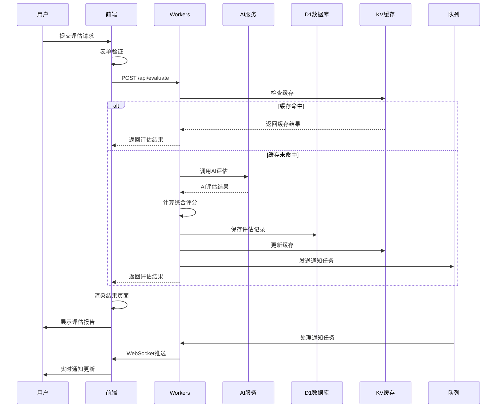

#### WebSocket实时通信时序
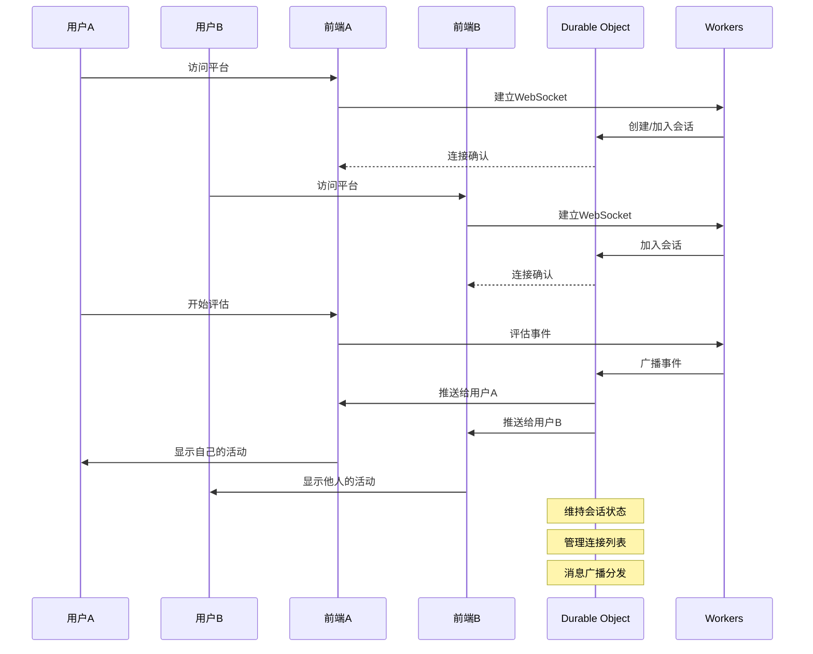

### 3.5 状态图

#### 评估任务状态转换
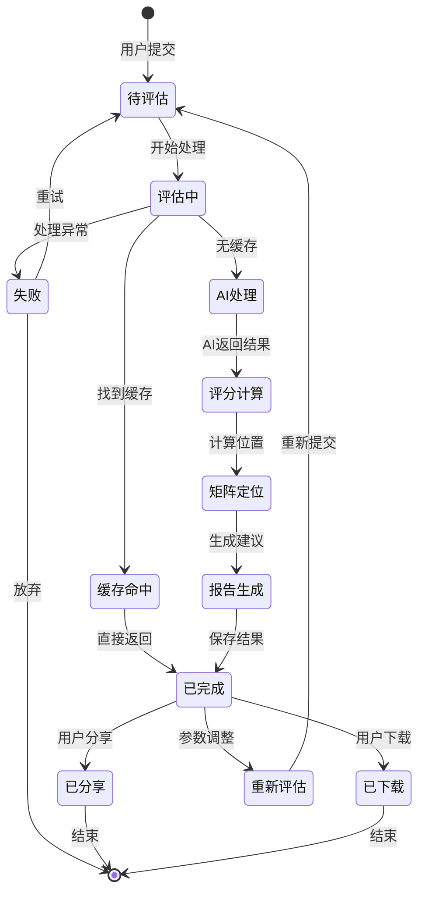

#### 用户会话状态
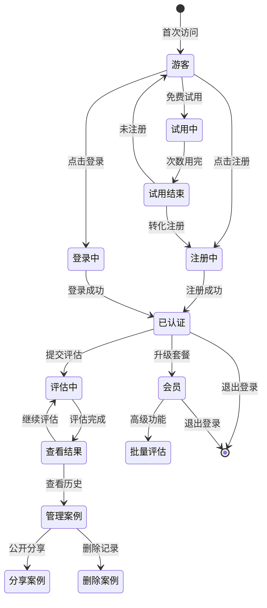

### 3.6 核心数据模型
```typescript
// 支持的AI模型配置
interface ModelConfig {
  id: string;
  name: string;
  provider: 'openai' | 'anthropic' | 'google' | 'deepseek' | 'alibaba';
  model: string;
  features: {
    maxTokens: number;
    supportJSON: boolean;
    speed: 'fast' | 'medium' | 'slow';
    quality: 'excellent' | 'good' | 'standard';
  };
  pricing: {
    inputPer1M: number;  // USD per 1M tokens
    outputPer1M: number; // USD per 1M tokens
  };
  recommended: string[]; // 推荐使用场景
}

// 预定义的模型配置
const SUPPORTED_MODELS: ModelConfig[] = [
  {
    id: 'gpt-5',
    name: 'GPT-5',
    provider: 'openai',
    model: 'gpt-5',
    features: {
      maxTokens: 16384,
      supportJSON: true,
      speed: 'fast',
      quality: 'excellent'
    },
    pricing: {
      inputPer1M: 12,
      outputPer1M: 36
    },
    recommended: ['复杂分析', '专业评估', '高准确度要求']
  },
  {
    id: 'claude-4.1-opus',
    name: 'Claude 4.1 Opus',
    provider: 'anthropic',
    model: 'claude-4.1-opus-20250120',
    features: {
      maxTokens: 200000,
      supportJSON: true,
      speed: 'medium',
      quality: 'excellent'
    },
    pricing: {
      inputPer1M: 15,
      outputPer1M: 75
    },
    recommended: ['长文本分析', '深度推理', '创意任务']
  },
  {
    id: 'claude-sonnet-4',
    name: 'Claude Sonnet 4',
    provider: 'anthropic',
    model: 'claude-sonnet-4-20250120',
    features: {
      maxTokens: 200000,
      supportJSON: true,
      speed: 'fast',
      quality: 'excellent'
    },
    pricing: {
      inputPer1M: 3,
      outputPer1M: 15
    },
    recommended: ['均衡性能', '日常任务', '快速响应']
  },
  {
    id: 'deepseek-3.1',
    name: 'DeepSeek 3.1',
    provider: 'deepseek',
    model: 'deepseek-3.1',
    features: {
      maxTokens: 65536,
      supportJSON: true,
      speed: 'fast',
      quality: 'excellent'
    },
    pricing: {
      inputPer1M: 0.27,
      outputPer1M: 1.10
    },
    recommended: ['代码生成', '技术评估', '性价比最优']
  },
  {
    id: 'qwen3',
    name: 'Qwen3',
    provider: 'alibaba',
    model: 'qwen3',
    features: {
      maxTokens: 32768,
      supportJSON: true,
      speed: 'fast',
      quality: 'excellent'
    },
    pricing: {
      inputPer1M: 1,
      outputPer1M: 2
    },
    recommended: ['中文优化', '本土场景', '多模态任务']
  }
];

// 评估任务
interface EvaluationTask {
  id: string;
  userId: string;
  projectName: string;
  description: string;
  modelId: string; // 选择的模型ID
  status: 'pending' | 'processing' | 'completed' | 'failed';
  result?: EvaluationResult;
  createdAt: Date;
  updatedAt: Date;
}

// 评估结果
interface EvaluationResult {
  taskId: string;
  totalScore: number;
  dimensions: {
    clarity: number;
    capability: number;
    objectivity: number;
    data: number;
    tolerance: number;
  };
  matrixPosition: {
    x: number; // LLM能力成熟度 (0-100)
    y: number; // 业务需求复杂度 (0-100)
    zone: 'optimal' | 'easy' | 'challenge' | 'infeasible' | 'over-investment';
  };
  recommendations: string[];
  risks: string[];
  roi: {
    developmentCost: number;
    operationalCost: number;
    expectedBenefit: number;
    paybackPeriod: number;
  };
}
```

## 4. UI/UX设计

### 4.1 设计理念

#### 品牌视觉定位
- **东方美学**：融入中国传统美学元素，体现"知几"的文化内涵
- **极简主义**：清晰的信息层级，去除冗余装饰
- **智慧感知**：通过渐变、光影营造智能科技感
- **流动体验**：自然的交互流程，如水般顺畅

### 4.2 设计系统

#### 色彩体系
```scss
// 主色调 - 智慧紫
$primary-gradient: linear-gradient(135deg, #667EEA 0%, #764BA2 100%);
$primary-500: #667EEA;
$primary-600: #5A67D8;

// 辅助色 - 洞察青
$secondary-500: #06B6D4;
$secondary-600: #0891B2;

// 语义色彩
$success: #10B981;   // 翠绿 - 可行
$warning: #F59E0B;   // 琥珀 - 谨慎
$danger: #EF4444;    // 朱红 - 风险
$info: #3B82F6;      // 靛蓝 - 信息

// 中性色 - 水墨灰阶
$gray-50: #FAFAFA;
$gray-100: #F4F4F5;
$gray-200: #E4E4E7;
$gray-300: #D4D4D8;
$gray-500: #71717A;
$gray-700: #3F3F46;
$gray-900: #18181B;
```

#### 字体系统
```css
/* 品牌字体 */
--font-brand: 'Noto Serif SC', serif;  /* 用于标题，体现文化底蕴 */
--font-primary: 'PingFang SC', -apple-system, sans-serif;  /* 主要内容 */
--font-mono: 'JetBrains Mono', monospace;  /* 代码和数据 */

/* 字体层级 */
--text-xs: 0.75rem;    /* 12px - 辅助信息 */
--text-sm: 0.875rem;   /* 14px - 正文小字 */
--text-base: 1rem;     /* 16px - 正文标准 */
--text-lg: 1.125rem;   /* 18px - 小标题 */
--text-xl: 1.25rem;    /* 20px - 标题 */
--text-2xl: 1.5rem;    /* 24px - 大标题 */
--text-3xl: 1.875rem;  /* 30px - 特大标题 */
--text-4xl: 2.25rem;   /* 36px - 巨大标题 */
```

### 4.3 页面原型设计

#### 首页设计（全新）
```
┌────────────────────────────────────────────────────┐
│  知几 ZhiJi                            登录 | 注册   │
├────────────────────────────────────────────────────┤
│                                                    │
│            ╱╲    知 几                             │
│           ╱  ╲   洞察先机 · 预见成败                │
│          ╱────╲                                    │
│         ╱      ╲  AI Agent 可行性评估平台           │
│                                                    │
│    ┌──────────────────────────────────────┐       │
│    │  🔍 描述您的AI Agent项目想法...        │       │
│    └──────────────────────────────────────┘       │
│              [ 开始智能评估 ]                       │
│                                                    │
│    或试试这些案例 →                                 │
│    ┌────────┐ ┌────────┐ ┌────────┐ ┌────────┐  │
│    │ 客服   │ │ 文档   │ │ 代码   │ │ 数据   │  │
│    │ 对话   │ │ 生成   │ │ 审查   │ │ 分析   │  │
│    │ 92分   │ │ 88分   │ │ 85分   │ │ 73分   │  │
│    └────────┘ └────────┘ └────────┘ └────────┘  │
│                                                    │
│  ═══════════════ 实时评估动态 ═══════════════      │
│  • @张三 正在评估「智能客服系统」                    │
│  • @李四 刚完成「代码生成器」评估 (85分)            │
│  • 今日已帮助 128 位创新者评估项目                  │
│                                                    │
│  [ 查看全部案例 → ]                                │
│                                                    │
└────────────────────────────────────────────────────┘
```

#### 评估流程页（步骤化设计）
```
┌────────────────────────────────────────────────────┐
│  知几 · 智能评估                     步骤 2/4      │
├────────────────────────────────────────────────────┤
│                                                    │
│  ● ━━━━━ ● ━━━━━ ○ ━━━━━ ○                      │
│  基本信息  需求描述  模型选择  确认提交             │
│                                                    │
│  ┌────────────────────────────────────────┐      │
│  │  🤖 选择评估模型                          │      │
│  │                                          │      │
│  │  推荐模型（基于您的需求）                 │      │
│  │  ┌──────────────────────────────┐       │      │
│  │  │ ⭐ GPT-5                       │       │      │
│  │  │ 最新最强 · 专业评估           │       │      │
│  │  │ 💰 $0.048/次评估              │       │      │
│  │  └──────────────────────────────┘       │      │
│  │                                          │      │
│  │  其他可选模型                            │      │
│  │  ┌──────────────────────────────┐       │      │
│  │  │ Claude 4.1 Opus               │       │      │
│  │  │ 深度推理 · 长文本 · $0.09/次  │       │      │
│  │  ├──────────────────────────────┤       │      │
│  │  │ Claude Sonnet 4               │       │      │
│  │  │ 均衡性能 · 快速 · $0.018/次   │       │      │
│  │  ├──────────────────────────────┤       │      │
│  │  │ DeepSeek 3.1                  │       │      │
│  │  │ 代码生成 · 极致性价比 · $0.002/次│       │      │
│  │  ├──────────────────────────────┤       │      │
│  │  │ Qwen3                         │       │      │
│  │  │ 中文优化 · 多模态 · $0.003/次 │       │      │
│  │  └──────────────────────────────┘       │      │
│  │                                          │      │
│  │  ℹ️ 不同模型各有特点，选择适合的即可    │      │
│  └────────────────────────────────────────┘      │
│                                                    │
│  [← 上一步]                        [下一步 →]      │
│                                                    │
└────────────────────────────────────────────────────┘
```

#### 评估结果页（优化版）
```
┌────────────────────────────────────────────────────┐
│  知几 · 评估报告                     分享 | 下载   │
├────────────────────────────────────────────────────┤
│                                                    │
│  项目：智能客服系统                                │
│  评估时间：2025-01-20 14:30                       │
│                                                    │
│  ┌──────────────────────────────────────────┐    │
│  │            综合评分：86分                  │    │
│  │         ████████████████░░░░               │    │
│  │                                            │    │
│  │    🎯 建议开发                              │    │
│  │    该项目位于"最大公约数"区域               │    │
│  │    技术成熟度高，商业价值明确               │    │
│  └──────────────────────────────────────────┘    │
│                                                    │
│  ┌─────────── 能力矩阵定位 ──────────┐           │
│  │                                    │           │
│  │    [交互式SVG矩阵图]                │           │
│  │     ● 您的项目                      │           │
│  │     ○ 类似案例                      │           │
│  │                                    │           │
│  │  LLM能力: ████████░░ 80%           │           │
│  │  需求复杂度: ██████░░░░ 60%        │           │
│  └────────────────────────────────────┘           │
│                                                    │
│  ┌─────────── 详细评分 ──────────────┐           │
│  │                                    │           │
│  │  任务清晰度      ●●●●●●●●●○ 90     │           │
│  │  能力匹配度      ●●●●●●●●○○ 85     │           │
│  │  评估客观性      ●●●●●●●○○○ 75     │           │
│  │  数据充足性      ●●●●●●●●●○ 88     │           │
│  │  容错成本        ●●●●●●●●●● 92     │           │
│  └────────────────────────────────────┘           │
│                                                    │
│  💡 关键建议                                       │
│  • 建议采用RAG技术提升回答准确性                   │
│  • 需要准备至少1000条对话样本进行训练              │
│  • 建议先从特定领域开始，逐步扩展                  │
│                                                    │
│  ⚠️ 潜在风险                                       │
│  • 多轮对话的上下文管理较复杂                      │
│  • 需要持续的模型调优和维护                        │
│                                                    │
│  [开始开发] [调整方案] [查看类似案例]              │
│                                                    │
└────────────────────────────────────────────────────┘
```

#### 移动端响应式设计
```
┌─────────────┐
│ 知几 ≡      │
├─────────────┤
│             │
│    知 几     │
│  洞察先机    │
│             │
│ ┌─────────┐ │
│ │描述项目..│ │
│ └─────────┘ │
│             │
│ [开始评估]  │
│             │
│ 热门案例    │
│ ┌─────────┐ │
│ │客服对话  │ │
│ │⭐92分    │ │
│ └─────────┘ │
│ ┌─────────┐ │
│ │代码审查  │ │
│ │⭐88分    │ │
│ └─────────┘ │
│             │
└─────────────┘
```

### 4.4 交互设计规范

#### 动效设计
```css
/* 过渡动画 */
--transition-fast: 150ms ease;
--transition-base: 250ms ease;
--transition-slow: 350ms ease;

/* 入场动画 */
@keyframes fadeInUp {
  from {
    opacity: 0;
    transform: translateY(20px);
  }
  to {
    opacity: 1;
    transform: translateY(0);
  }
}

/* 脉冲效果 - 用于实时数据 */
@keyframes pulse {
  0%, 100% { opacity: 1; }
  50% { opacity: 0.5; }
}

/* 水波纹效果 - 用于点击反馈 */
@keyframes ripple {
  to {
    transform: scale(4);
    opacity: 0;
  }
}
```

#### 组件状态
```scss
// 按钮状态
.btn {
  // 默认
  background: $gray-100;
  
  // 悬停
  &:hover {
    background: $gray-200;
    transform: translateY(-2px);
    box-shadow: 0 4px 12px rgba(0,0,0,0.1);
  }
  
  // 激活
  &:active {
    transform: translateY(0);
  }
  
  // 禁用
  &:disabled {
    opacity: 0.5;
    cursor: not-allowed;
  }
  
  // 主要按钮
  &.btn-primary {
    background: $primary-gradient;
    color: white;
  }
}
```

### 4.5 组件库规范（基于 shadcn/ui）

```typescript
// 核心组件定义
interface ComponentSystem {
  // 基础组件
  base: {
    Card: '信息展示卡片',
    Button: '操作按钮',
    Input: '单行输入框',
    Textarea: '多行输入框',
    Select: '下拉选择',
    Checkbox: '复选框',
    Radio: '单选框'
  };
  
  // 反馈组件
  feedback: {
    Progress: '进度条',
    Skeleton: '骨架屏',
    Spinner: '加载动画',
    Toast: '轻提示',
    Alert: '警告提示',
    Dialog: '对话框',
    Tooltip: '工具提示'
  };
  
  // 数据展示
  display: {
    Badge: '标签徽章',
    Avatar: '头像',
    Table: '数据表格',
    Tabs: '选项卡',
    Accordion: '折叠面板'
  };
  
  // 导航组件
  navigation: {
    Breadcrumb: '面包屑',
    Pagination: '分页',
    Steps: '步骤条',
    Navigation: '导航菜单'
  };
}
```

## 5. 分层可视化实现（核心创新）

### 5.1 分层架构设计

采用分层叠加的方式，保持原始SVG作为底图，通过HTML/CSS层实现动态标注：

```html
<!-- 可视化容器结构 -->
<div class="matrix-container relative w-full max-w-4xl mx-auto">
  <!-- 层1: SVG底图 -->
  
  
  <!-- 层2: 项目定位层 -->
  <div class="absolute inset-0 pointer-events-none">
    <!-- 动态生成的项目标注点 -->
    <div 
      v-for="project in projects"
      :key="project.id"
      class="project-marker"
      :style="{
        left: `${project.x}%`,
        top: `${project.y}%`,
        '--delay': `${project.animationDelay}ms`
      }"
    >
      <div class="marker-dot"></div>
      <div class="marker-label">{{ project.name }}</div>
      <div class="marker-score">{{ project.score }}/100</div>
    </div>
  </div>
  
  <!-- 层3: 交互提示层 -->
  <div class="absolute inset-0 pointer-events-none">
    <div class="hover-tooltip" v-if="hoveredProject">
      <!-- 详细信息弹窗 -->
    </div>
  </div>
</div>
```

### 5.2 坐标映射算法

```typescript
// 将评估结果映射到SVG坐标系
interface CoordinateMapper {
  // SVG视图框定义
  viewBox: { x: 0, y: 0, width: 900, height: 600 };
  // 实际坐标系范围（考虑边距）
  chartArea: { 
    left: 150,   // X起点（像素）
    right: 750,  // X终点（像素）
    top: 150,    // Y起点（像素）
    bottom: 450  // Y终点（像素）
  };
}

function mapToViewport(evaluation: EvaluationResult): ProjectPosition {
  const mapper = new CoordinateMapper();
  
  // 计算LLM能力成熟度（0-100）
  const llmScore = calculateLLMCapability(evaluation);
  
  // 计算业务复杂度（0-100）
  const complexity = calculateComplexity(evaluation);
  
  // 转换为相对百分比位置
  const relativeX = (mapper.chartArea.left + 
    (llmScore / 100) * (mapper.chartArea.right - mapper.chartArea.left)) 
    / mapper.viewBox.width * 100;
    
  const relativeY = (mapper.chartArea.bottom - 
    (complexity / 100) * (mapper.chartArea.bottom - mapper.chartArea.top)) 
    / mapper.viewBox.height * 100;
  
  return {
    x: relativeX,
    y: relativeY,
    zone: determineZone(llmScore, complexity),
    score: evaluation.totalScore
  };
}
```

### 5.3 CSS动画效果

```css
/* 项目标注点样式 */
.project-marker {
  position: absolute;
  transform: translate(-50%, -50%);
  animation: dropIn 0.6s ease-out var(--delay, 0ms) forwards;
  opacity: 0;
}

@keyframes dropIn {
  0% {
    opacity: 0;
    transform: translate(-50%, -150%) scale(0.5);
  }
  50% {
    opacity: 1;
    transform: translate(-50%, -45%) scale(1.1);
  }
  100% {
    opacity: 1;
    transform: translate(-50%, -50%) scale(1);
  }
}

.marker-dot {
  width: 24px;
  height: 24px;
  border-radius: 50%;
  background: linear-gradient(135deg, #667eea 0%, #764ba2 100%);
  box-shadow: 0 4px 15px rgba(102, 126, 234, 0.4);
  position: relative;
  cursor: pointer;
  transition: all 0.3s ease;
}

.marker-dot:hover {
  transform: scale(1.2);
  box-shadow: 0 6px 20px rgba(102, 126, 234, 0.6);
}

/* 脉冲动画效果 */
.marker-dot::before {
  content: '';
  position: absolute;
  inset: -8px;
  border-radius: 50%;
  border: 2px solid rgba(102, 126, 234, 0.3);
  animation: pulse 2s infinite;
}

@keyframes pulse {
  0%, 100% {
    transform: scale(1);
    opacity: 1;
  }
  50% {
    transform: scale(1.3);
    opacity: 0;
  }
}

.marker-label {
  position: absolute;
  top: 100%;
  left: 50%;
  transform: translateX(-50%);
  margin-top: 8px;
  padding: 4px 8px;
  background: rgba(0, 0, 0, 0.8);
  color: white;
  font-size: 12px;
  border-radius: 4px;
  white-space: nowrap;
}
```

### 5.4 React组件实现

```typescript
import { useState, useEffect, useRef } from 'react';
import Image from 'next/image';

interface MatrixVisualizationProps {
  project: EvaluationResult;
  showComparison?: boolean;
  comparisons?: EvaluationResult[];
}

export const MatrixVisualization: React.FC<MatrixVisualizationProps> = ({
  project,
  showComparison = false,
  comparisons = []
}) => {
  const containerRef = useRef<HTMLDivElement>(null);
  const [dimensions, setDimensions] = useState({ width: 0, height: 0 });
  const [hoveredProject, setHoveredProject] = useState<string | null>(null);
  
  // 响应式尺寸计算
  useEffect(() => {
    const updateDimensions = () => {
      if (containerRef.current) {
        const { width, height } = containerRef.current.getBoundingClientRect();
        setDimensions({ width, height });
      }
    };
    
    updateDimensions();
    window.addEventListener('resize', updateDimensions);
    return () => window.removeEventListener('resize', updateDimensions);
  }, []);
  
  // 计算项目位置
  const projectPosition = mapToViewport(project);
  const comparisonPositions = comparisons.map(mapToViewport);
  
  return (
    <div ref={containerRef} className="matrix-container relative">
      {/* SVG底图 */}
      <Image
        src="/images/capability-matrix.svg"
        alt="AI Agent 能力矩阵"
        width={900}
        height={600}
        className="w-full h-auto"
        priority
      />
      
      {/* 项目定位层 */}
      <div className="absolute inset-0">
        {/* 主项目标注 */}
        <ProjectMarker
          project={project}
          position={projectPosition}
          isPrimary={true}
          onHover={() => setHoveredProject(project.id)}
          onLeave={() => setHoveredProject(null)}
        />
        
        {/* 对比项目标注 */}
        {showComparison && comparisonPositions.map((pos, idx) => (
          <ProjectMarker
            key={comparisons[idx].id}
            project={comparisons[idx]}
            position={pos}
            isPrimary={false}
            animationDelay={200 * (idx + 1)}
          />
        ))}
      </div>
      
      {/* 悬浮信息卡片 */}
      {hoveredProject && (
        <ProjectInfoCard
          project={project}
          position={projectPosition}
        />
      )}
    </div>
  );
};
```

### 5.2 项目定位算法
```typescript
function calculateProjectPosition(evaluation: EvaluationResult): ProjectPosition {
  // LLM能力成熟度计算 (X轴)
  const llmCapability = calculateLLMCapability({
    taskType: evaluation.taskType,
    requiredModels: evaluation.requiredModels,
    technicalMaturity: evaluation.technicalMaturity
  });
  
  // 业务需求复杂度计算 (Y轴)
  const complexity = calculateComplexity({
    features: evaluation.features,
    integrations: evaluation.integrations,
    constraints: evaluation.constraints
  });
  
  // 区域判定
  const zone = determineZone(llmCapability, complexity);
  
  return {
    x: llmCapability,
    y: 100 - complexity, // SVG坐标系Y轴反向
    zone: zone,
    color: colors.zones[zone]
  };
}

function determineZone(x: number, y: number): Zone {
  // 最大公约数区域 (椭圆形判定)
  const centerX = 55, centerY = 50;
  const radiusX = 25, radiusY = 20;
  const inOptimal = Math.pow((x - centerX) / radiusX, 2) + 
                     Math.pow((y - centerY) / radiusY, 2) <= 1;
  
  if (inOptimal) return 'optimal';
  
  // 其他区域判定
  if (x < 35 && y > 65) return 'infeasible';
  if (x >= 35 && x < 65 && y > 65) return 'challenge';
  if (x >= 65 && y < 35) return 'overInvestment';
  if (x < 35 && y < 35) return 'easy';
  
  return 'challenge'; // 默认挑战区域
}
```

## 6. 案例展示系统（公开展示页）

### 6.1 系统架构（类似 manus.im）

```
┌────────────────────────────────────────────────┐
│                  公开展示页                      │
├────────────────────────────────────────────────┤
│                                                │
│  🔥 热门案例                    🎯 精选案例      │
│  ┌──────────┐  ┌──────────┐  ┌──────────┐    │
│  │ 客服机器人 │  │ 代码审查  │  │ 周报生成  │    │
│  │ ⭐ 92分   │  │ ⭐ 88分   │  │ ⭐ 95分   │    │
│  └──────────┘  └──────────┘  └──────────┘    │
│                                                │
│  📊 实时评估流                                  │
│  ┌────────────────────────────────────────┐   │
│  │ @用户A 正在评估 "智能客服系统"...         │   │
│  │ @用户B 刚刚完成 "代码生成器" 评估 (85分)  │   │
│  │ @用户C 正在评估 "数据分析助手"...         │   │
│  └────────────────────────────────────────┘   │
│                                                │
│  🗺️ 能力矩阵全景                               │
│  ┌────────────────────────────────────────┐   │
│  │     [实时更新的能力矩阵图]                │   │
│  │     • 显示所有公开案例位置                 │   │
│  │     • 热力图展示密集区域                   │   │
│  └────────────────────────────────────────┘   │
│                                                │
└────────────────────────────────────────────────┘
```

### 6.2 案例卡片组件

```typescript
interface CaseCard {
  id: string;
  projectName: string;
  description: string;
  score: number;
  zone: string;
  tags: string[];
  author: {
    name: string;
    avatar?: string;
  };
  metrics: {
    views: number;
    likes: number;
    shares: number;
  };
  createdAt: Date;
  featured: boolean;
}

// React组件
export const CaseCard: React.FC<{ case: CaseCard }> = ({ case }) => {
  return (
    <div className="group relative bg-white rounded-xl shadow-sm hover:shadow-xl transition-all duration-300 p-6">
      {/* 特色标记 */}
      {case.featured && (
        <div className="absolute -top-2 -right-2 bg-gradient-to-r from-yellow-400 to-orange-500 text-white text-xs px-3 py-1 rounded-full">
          ✨ 精选
        </div>
      )}
      
      {/* 评分显示 */}
      <div className="flex items-center justify-between mb-4">
        <div className="flex items-center gap-2">
          <div className={`text-3xl font-bold ${getScoreColor(case.score)}`}>
            {case.score}
          </div>
          <div className="text-sm text-gray-500">/ 100</div>
        </div>
        <div className={`px-3 py-1 rounded-full text-xs ${getZoneStyle(case.zone)}`}>
          {getZoneLabel(case.zone)}
        </div>
      </div>
      
      {/* 项目信息 */}
      <h3 className="text-lg font-semibold mb-2 group-hover:text-blue-600 transition-colors">
        {case.projectName}
      </h3>
      <p className="text-gray-600 text-sm mb-4 line-clamp-2">
        {case.description}
      </p>
      
      {/* 标签 */}
      <div className="flex flex-wrap gap-2 mb-4">
        {case.tags.map(tag => (
          <span key={tag} className="px-2 py-1 bg-gray-100 text-gray-600 text-xs rounded">
            {tag}
          </span>
        ))}
      </div>
      
      {/* 互动数据 */}
      <div className="flex items-center justify-between text-xs text-gray-500">
        <div className="flex items-center gap-4">
          <span>👀 {formatNumber(case.metrics.views)}</span>
          <span>❤️ {formatNumber(case.metrics.likes)}</span>
          <span>🔗 {formatNumber(case.metrics.shares)}</span>
        </div>
        <div className="flex items-center gap-2">
          
          <span>{case.author.name}</span>
        </div>
      </div>
    </div>
  );
};
```

### 6.3 实时评估流组件

```typescript
// 实时展示其他用户的评估活动
export const LiveEvaluationStream: React.FC = () => {
  const [activities, setActivities] = useState<Activity[]>([]);
  
  useEffect(() => {
    // WebSocket连接获取实时数据
    const ws = new WebSocket(process.env.NEXT_PUBLIC_WS_URL);
    
    ws.onmessage = (event) => {
      const activity = JSON.parse(event.data);
      setActivities(prev => [activity, ...prev].slice(0, 10));
    };
    
    return () => ws.close();
  }, []);
  
  return (
    <div className="bg-gray-50 rounded-lg p-4">
      <h3 className="text-sm font-semibold text-gray-700 mb-3 flex items-center gap-2">
        <span className="relative flex h-3 w-3">
          <span className="animate-ping absolute inline-flex h-full w-full rounded-full bg-green-400 opacity-75"></span>
          <span className="relative inline-flex rounded-full h-3 w-3 bg-green-500"></span>
        </span>
        实时评估动态
      </h3>
      
      <div className="space-y-2">
        {activities.map((activity, idx) => (
          <div 
            key={activity.id}
            className="text-sm animate-slide-in"
            style={{ animationDelay: `${idx * 100}ms` }}
          >
            {activity.type === 'evaluating' ? (
              <div className="flex items-center gap-2">
                <span className="text-gray-600">@{activity.user}</span>
                <span className="text-gray-400">正在评估</span>
                <span className="font-medium">"{activity.project}"</span>
                <div className="flex gap-1">
                  <span className="w-1 h-1 bg-gray-400 rounded-full animate-bounce" style={{ animationDelay: '0ms' }}></span>
                  <span className="w-1 h-1 bg-gray-400 rounded-full animate-bounce" style={{ animationDelay: '150ms' }}></span>
                  <span className="w-1 h-1 bg-gray-400 rounded-full animate-bounce" style={{ animationDelay: '300ms' }}></span>
                </div>
              </div>
            ) : (
              <div className="flex items-center gap-2">
                <span className="text-gray-600">@{activity.user}</span>
                <span className="text-gray-400">完成了</span>
                <span className="font-medium">"{activity.project}"</span>
                <span className={`font-bold ${getScoreColor(activity.score)}`}>
                  ({activity.score}分)
                </span>
              </div>
            )}
          </div>
        ))}
      </div>
    </div>
  );
};
```

### 6.4 全景矩阵视图

```typescript
// 展示所有公开案例的矩阵分布
export const MatrixPanorama: React.FC = () => {
  const [cases, setCases] = useState<CasePosition[]>([]);
  const [hoveredCase, setHoveredCase] = useState<string | null>(null);
  
  return (
    <div className="relative w-full">
      {/* SVG底图 */}
      
      
      {/* 热力图层 */}
      <div className="absolute inset-0">
        <HeatmapOverlay data={cases} />
      </div>
      
      {/* 案例点位层 */}
      <div className="absolute inset-0">
        {cases.map(caseItem => (
          <div
            key={caseItem.id}
            className="absolute w-2 h-2 bg-white border-2 border-purple-500 rounded-full cursor-pointer hover:scale-150 transition-transform"
            style={{
              left: `${caseItem.x}%`,
              top: `${caseItem.y}%`,
              transform: 'translate(-50%, -50%)'
            }}
            onMouseEnter={() => setHoveredCase(caseItem.id)}
            onMouseLeave={() => setHoveredCase(null)}
          />
        ))}
      </div>
      
      {/* 悬浮信息 */}
      {hoveredCase && (
        <CaseTooltip caseId={hoveredCase} />
      )}
    </div>
  );
};
```

## 7. 运营后台系统

### 7.1 后台功能模块

```typescript
interface AdminDashboard {
  // 核心功能
  caseManagement: {
    review: '审核待发布案例';
    feature: '精选优秀案例';
    hide: '隐藏低质量案例';
    edit: '编辑案例信息';
  };
  
  // 数据分析
  analytics: {
    usage: '使用统计';
    trends: '趋势分析';
    userBehavior: '用户行为';
    conversionRate: '转化率';
  };
  
  // 运营工具
  operations: {
    notifications: '推送管理';
    campaigns: '活动配置';
    recommendations: '推荐算法';
    moderation: '内容审核';
  };
}
```

### 7.2 案例审核流程

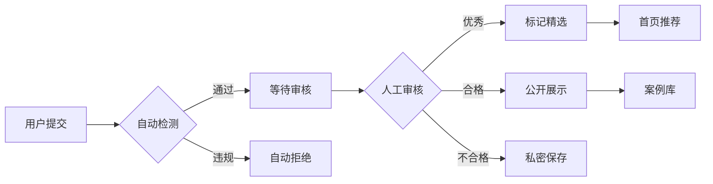

### 7.3 精选标准

| 维度 | 权重 | 标准 |
|------|------|------|
| 评分高 | 30% | 85分以上 |
| 描述完整 | 25% | 详细的项目说明 |
| 创新性 | 20% | 独特的应用场景 |
| 实用性 | 15% | 有实际应用价值 |
| 互动度 | 10% | 高浏览/点赞数 |

## 8. 部署架构

### 8.1 Cloudflare全球部署架构
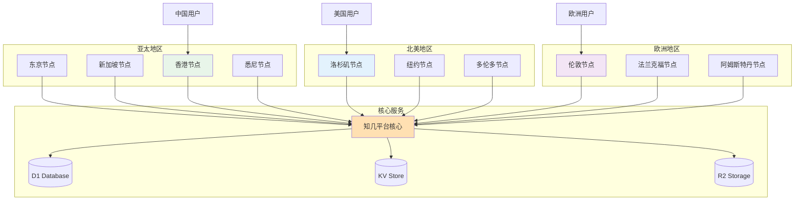

### 8.2 CI/CD流水线
```mermaid
flowchart LR
    subgraph "开发阶段"
        Dev[本地开发]
        Test[单元测试]
        Lint[代码检查]
    end
    
    subgraph "构建阶段"
        Build[构建应用]
        Bundle[打包优化]
        Type[类型检查]
    end
    
    subgraph "测试阶段"
        E2E[E2E测试]
        Perf[性能测试]
        Sec[安全扫描]
    end
    
    subgraph "部署阶段"
        Preview[预览环境]
        Stage[预发布]
        Prod[生产环境]
    end
    
    subgraph "监控阶段"
        Monitor[性能监控]
        Log[日志分析]
        Alert[告警通知]
    end
    
    Dev --> Test
    Test --> Lint
    Lint --> Build
    
    Build --> Bundle
    Bundle --> Type
    Type --> E2E
    
    E2E --> Perf
    Perf --> Sec
    Sec --> Preview
    
    Preview --> Stage
    Stage --> Prod
    
    Prod --> Monitor
    Monitor --> Log
    Log --> Alert
    Alert --> Dev
    
    style Dev fill:#E8F5E9
    style Prod fill:#FFE0B2
    style Alert fill:#FFEBEE
```

### 8.3 异常处理流程
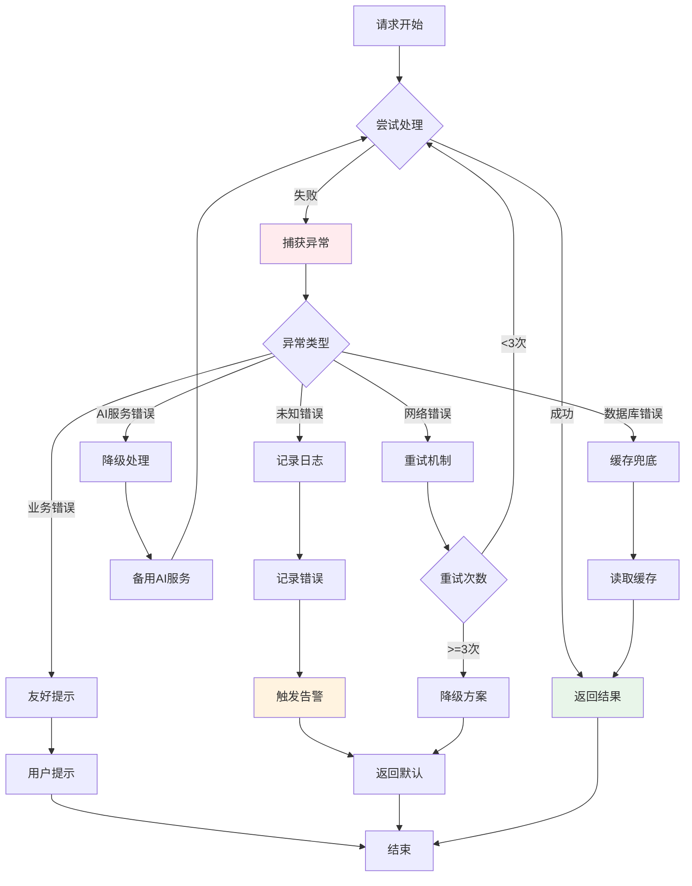

## 9. 开发计划

### 9.1 开发阶段
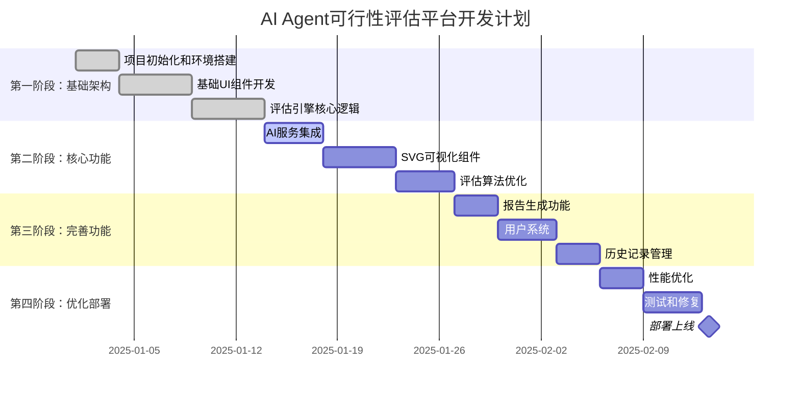

### 8.2 里程碑
| 阶段 | 时间 | 交付物 | 成功标准 |
|------|------|--------|----------|
| MVP | 2周 | 基础评估功能 | 能完成基本评估流程 |
| Beta | 4周 | 完整功能版本 | 所有核心功能可用 |
| v1.0 | 6周 | 生产就绪版本 | 性能达标，无重大bug |

### 8.3 开发难度评估

#### 技术难点
| 模块 | 难度 | 说明 | 解决方案 |
|------|------|------|----------|
| AI提示词优化 | ⭐⭐⭐⭐ | 需要精确的评估逻辑 | 迭代测试，收集反馈 |
| SVG动态渲染 | ⭐⭐⭐ | 复杂的交互和动画 | 使用D3.js或Framer Motion |
| 评分算法 | ⭐⭐⭐ | 权重和规则设计 | 参考最佳实践，A/B测试 |
| 性能优化 | ⭐⭐ | API调用成本控制 | 缓存策略，批处理 |

#### 资源需求
- **人力**：1-2名全栈开发者
- **时间**：4-6周完成MVP
- **成本**：
  - 开发成本：约5-10万元
  - 运营成本：约2000元/月（API费用）
  - 基础设施：约500元/月

## 9. 风险评估与缓解

### 9.1 技术风险
| 风险 | 概率 | 影响 | 缓解措施 |
|------|------|------|----------|
| AI API不稳定 | 中 | 高 | 缓存机制，降级方案 |
| 评估准确性不足 | 中 | 高 | 持续优化算法，用户反馈循环 |
| 性能瓶颈 | 低 | 中 | 缓存优化，异步处理 |

### 9.2 业务风险
| 风险 | 概率 | 影响 | 缓解措施 |
|------|------|------|----------|
| 用户接受度低 | 中 | 高 | 免费试用，案例展示 |
| 竞品出现 | 高 | 中 | 快速迭代，差异化定位 |
| 成本超支 | 低 | 中 | 严格的配额管理 |

## 10. 成功指标

### 10.1 产品指标
- **用户指标**
  - MAU: 1000+ (6个月目标)
  - 留存率: 40%+ (次月)
  - NPS: 50+

- **使用指标**
  - 日均评估数: 100+
  - 评估完成率: 85%+
  - 报告下载率: 60%+

### 10.2 技术指标
- **性能指标**
  - 评估响应时间: <5秒
  - 页面加载时间: <2秒
  - API可用性: 99.9%+

- **质量指标**
  - 评估准确率: 85%+ (用户反馈验证)
  - Bug率: <1%
  - 代码覆盖率: 80%+

## 11. 产品路线图

### Phase 1 - MVP (当前)
- ✅ 基础评估功能
- ✅ 简单可视化
- ✅ 基础报告

### Phase 2 - 增强版 (Q2 2025)
- 🔄 多语言支持
- 🔄 团队协作功能
- 🔄 API开放

### Phase 3 - 企业版 (Q3 2025)
- 📋 批量评估
- 📋 自定义评估模型
- 📋 私有化部署

### Phase 4 - 智能化 (Q4 2025)
- 🚀 自动优化建议
- 🚀 项目跟踪
- 🚀 成功率预测

## 12. 完整技术实现示例

### 12.1 主页面实现 (app/page.tsx)

```typescript
'use client';

import { useState } from 'react';
import { Button } from '@/components/ui/button';
import { Input } from '@/components/ui/input';
import { Textarea } from '@/components/ui/textarea';
import { Card } from '@/components/ui/card';
import { MatrixVisualization } from '@/components/matrix-visualization';
import { LiveEvaluationStream } from '@/components/live-stream';
import { CaseGallery } from '@/components/case-gallery';

export default function Home() {
  const [projectData, setProjectData] = useState({
    name: '',
    description: '',
    targetUsers: '',
    expectedFeatures: []
  });
  const [evaluationResult, setEvaluationResult] = useState(null);
  const [isEvaluating, setIsEvaluating] = useState(false);

  const handleEvaluate = async () => {
    setIsEvaluating(true);
    try {
      const response = await fetch('/api/evaluate', {
        method: 'POST',
        headers: { 'Content-Type': 'application/json' },
        body: JSON.stringify(projectData)
      });
      const result = await response.json();
      setEvaluationResult(result);
    } finally {
      setIsEvaluating(false);
    }
  };

  return (
    <div className="min-h-screen bg-gradient-to-br from-gray-50 to-gray-100">
      {/* 标题区 */}
      <header className="py-8 px-4 text-center">
        <h1 className="text-4xl font-bold bg-gradient-to-r from-purple-600 to-blue-600 bg-clip-text text-transparent">
          知几 - AI Agent 可行性评估平台
        </h1>
        <p className="mt-2 text-gray-600">
          洞察先机，预见成败 | 让每个AI创新者都能"见几而作"
        </p>
      </header>

      <div className="container mx-auto px-4 py-8">
        <div className="grid lg:grid-cols-3 gap-8">
          {/* 左侧：输入表单 */}
          <div className="lg:col-span-1">
            <Card className="p-6">
              <h2 className="text-lg font-semibold mb-4">项目信息</h2>
              <div className="space-y-4">
                <Input
                  placeholder="项目名称"
                  value={projectData.name}
                  onChange={(e) => setProjectData({...projectData, name: e.target.value})}
                />
                <Textarea
                  placeholder="项目描述"
                  rows={4}
                  value={projectData.description}
                  onChange={(e) => setProjectData({...projectData, description: e.target.value})}
                />
                <Input
                  placeholder="目标用户"
                  value={projectData.targetUsers}
                  onChange={(e) => setProjectData({...projectData, targetUsers: e.target.value})}
                />
                <Button 
                  className="w-full"
                  onClick={handleEvaluate}
                  disabled={isEvaluating}
                >
                  {isEvaluating ? '评估中...' : '开始评估'}
                </Button>
              </div>
            </Card>

            {/* 实时评估流 */}
            <div className="mt-6">
              <LiveEvaluationStream />
            </div>
          </div>

          {/* 中间：可视化结果 */}
          <div className="lg:col-span-2">
            {evaluationResult ? (
              <Card className="p-6">
                <h2 className="text-lg font-semibold mb-4">评估结果</h2>
                
                {/* 总分显示 */}
                <div className="text-center mb-6">
                  <div className="text-5xl font-bold text-purple-600">
                    {evaluationResult.totalScore}
                  </div>
                  <div className="text-gray-500">总分 / 100</div>
                  <div className={`mt-2 px-4 py-2 rounded-full inline-block ${
                    evaluationResult.totalScore >= 85 ? 'bg-green-100 text-green-800' :
                    evaluationResult.totalScore >= 70 ? 'bg-yellow-100 text-yellow-800' :
                    'bg-red-100 text-red-800'
                  }`}>
                    {evaluationResult.totalScore >= 85 ? '✅ 强烈建议开发' :
                     evaluationResult.totalScore >= 70 ? '⚠️ 谨慎评估' :
                     '❌ 不建议开发'}
                  </div>
                </div>

                {/* 能力矩阵可视化 */}
                <MatrixVisualization project={evaluationResult} />

                {/* 详细评分 */}
                <div className="mt-6 space-y-3">
                  {Object.entries(evaluationResult.dimensions).map(([key, value]) => (
                    <div key={key} className="flex items-center justify-between">
                      <span className="text-sm text-gray-600">{key}</span>
                      <div className="flex items-center gap-2">
                        <div className="w-32 bg-gray-200 rounded-full h-2">
                          <div 
                            className="bg-purple-600 h-2 rounded-full"
                            style={{ width: `${value}%` }}
                          />
                        </div>
                        <span className="text-sm font-medium w-12 text-right">{value}</span>
                      </div>
                    </div>
                  ))}
                </div>

                {/* 建议和风险 */}
                <div className="mt-6 grid md:grid-cols-2 gap-4">
                  <div>
                    <h3 className="font-medium mb-2">💡 建议</h3>
                    <ul className="text-sm text-gray-600 space-y-1">
                      {evaluationResult.suggestions.map((s, i) => (
                        <li key={i}>• {s}</li>
                      ))}
                    </ul>
                  </div>
                  <div>
                    <h3 className="font-medium mb-2">⚠️ 风险</h3>
                    <ul className="text-sm text-gray-600 space-y-1">
                      {evaluationResult.risks.map((r, i) => (
                        <li key={i}>• {r}</li>
                      ))}
                    </ul>
                  </div>
                </div>
              </Card>
            ) : (
              /* 精选案例展示 */
              <CaseGallery />
            )}
          </div>
        </div>
      </div>
    </div>
  );
}
```

### 12.2 Cloudflare Workers API 实现 (workers/api/evaluate.ts)

```typescript
// Cloudflare Workers环境的API实现
import { Hono } from 'hono';
import { cors } from 'hono/cors';

const app = new Hono();

app.use('/*', cors());

export interface Env {
  DB: D1Database;
  KV: KVNamespace;
  OPENAI_API_KEY: string;
  ANTHROPIC_API_KEY: string;
  GOOGLE_API_KEY: string;
  DEEPSEEK_API_KEY: string;
  QWEN_API_KEY: string;
  QUEUE: Queue;
}

// AI模型调用服务
class AIModelService {
  constructor(private env: Env) {}
  
  async callModel(modelId: string, prompt: string): Promise<any> {
    const model = SUPPORTED_MODELS.find(m => m.id === modelId);
    if (!model) throw new Error(`Unsupported model: ${modelId}`);
    
    switch (model.provider) {
      case 'openai':
        return this.callOpenAI(model, prompt);
      case 'anthropic':
        return this.callAnthropic(model, prompt);
      case 'google':
        return this.callGemini(model, prompt);
      case 'deepseek':
        return this.callDeepSeek(model, prompt);
      case 'alibaba':
        return this.callQwen(model, prompt);
      default:
        throw new Error(`Provider not implemented: ${model.provider}`);
    }
  }
  
  private async callOpenAI(model: ModelConfig, prompt: string) {
    const response = await fetch('https://api.openai.com/v1/chat/completions', {
      method: 'POST',
      headers: {
        'Authorization': `Bearer ${this.env.OPENAI_API_KEY}`,
        'Content-Type': 'application/json',
      },
      body: JSON.stringify({
        model: model.model,
        messages: [{ role: "user", content: prompt }],
        response_format: { type: "json_object" }
      })
    });
    const data = await response.json();
    return JSON.parse(data.choices[0].message.content);
  }
  
  private async callAnthropic(model: ModelConfig, prompt: string) {
    const response = await fetch('https://api.anthropic.com/v1/messages', {
      method: 'POST',
      headers: {
        'x-api-key': this.env.ANTHROPIC_API_KEY,
        'anthropic-version': '2023-06-01',
        'Content-Type': 'application/json',
      },
      body: JSON.stringify({
        model: model.model,
        messages: [{ role: "user", content: prompt }],
        max_tokens: 4096
      })
    });
    const data = await response.json();
    return JSON.parse(data.content[0].text);
  }
  
  private async callGemini(model: ModelConfig, prompt: string) {
    const response = await fetch(
      `https://generativelanguage.googleapis.com/v1beta/models/${model.model}:generateContent?key=${this.env.GOOGLE_API_KEY}`,
      {
        method: 'POST',
        headers: { 'Content-Type': 'application/json' },
        body: JSON.stringify({
          contents: [{ parts: [{ text: prompt }] }]
        })
      }
    );
    const data = await response.json();
    return JSON.parse(data.candidates[0].content.parts[0].text);
  }
  
  private async callDeepSeek(model: ModelConfig, prompt: string) {
    const response = await fetch('https://api.deepseek.com/v1/chat/completions', {
      method: 'POST',
      headers: {
        'Authorization': `Bearer ${this.env.DEEPSEEK_API_KEY}`,
        'Content-Type': 'application/json',
      },
      body: JSON.stringify({
        model: model.model,
        messages: [{ role: "user", content: prompt }]
      })
    });
    const data = await response.json();
    return JSON.parse(data.choices[0].message.content);
  }
  
  private async callQwen(model: ModelConfig, prompt: string) {
    const response = await fetch('https://dashscope.aliyuncs.com/api/v1/services/aigc/text-generation/generation', {
      method: 'POST',
      headers: {
        'Authorization': `Bearer ${this.env.QWEN_API_KEY}`,
        'Content-Type': 'application/json',
      },
      body: JSON.stringify({
        model: model.model,
        input: { messages: [{ role: "user", content: prompt }] },
        parameters: { result_format: 'message' }
      })
    });
    const data = await response.json();
    return JSON.parse(data.output.choices[0].message.content);
  }
}

app.post('/api/evaluate', async (c) => {
  const env = c.env as Env;
  const { projectData, modelId = 'gpt-5' } = await c.req.json(); // 默认使用GPT-5
  
  // 构建评估提示词
  const prompt = `
    作为AI Agent可行性评估专家，请评估以下项目：
    
    项目名称：${projectData.name}
    项目描述：${projectData.description}
    目标用户：${projectData.targetUsers}
    
    请从以下维度评分（0-100）：
    1. 任务定义清晰度
    2. LLM能力匹配度
    3. 评估标准客观性
    4. 样例数据充足性
    5. 失败容错成本
    
    并给出：
    - 总分
    - 在能力矩阵中的位置（x: LLM能力成熟度 0-100, y: 业务需求复杂度 0-100）
    - 所在区域（optimal/easy/challenge/infeasible/over-investment）
    - 3条具体建议
    - 3个主要风险
    
    返回JSON格式。
  `;
  
  // 先检查缓存
  const cacheKey = `eval:${modelId}:${JSON.stringify(projectData)}`;
  const cached = await env.KV.get(cacheKey);
  if (cached) {
    return c.json(JSON.parse(cached));
  }
  
  // 使用选定的模型进行评估
  const aiService = new AIModelService(env);
  try {
    const result = await aiService.callModel(modelId, prompt);
    
    // 添加使用的模型信息
    result.modelUsed = modelId;
    result.modelInfo = SUPPORTED_MODELS.find(m => m.id === modelId);
  
    // 保存到D1数据库
    await env.DB.prepare(
      'INSERT INTO evaluations (project_name, total_score, model_used, result) VALUES (?, ?, ?, ?)'
    ).bind(projectData.name, result.totalScore, modelId, JSON.stringify(result)).run();
    
    // 缓存结果（1小时）
    await env.KV.put(cacheKey, JSON.stringify(result), { expirationTtl: 3600 });
    
    // 发送到队列处理WebSocket通知
    await env.QUEUE.send({
      type: 'evaluation_completed',
      data: {
        user: projectData.userId || 'Anonymous',
        project: projectData.name,
        score: result.totalScore,
        model: modelId
      }
    });
    
    return c.json(result);
  } catch (error) {
    console.error('Evaluation error:', error);
    return c.json({ error: 'Evaluation failed', details: error.message }, 500);
  }
});

export default app;
```

### 12.3 Cloudflare D1 数据库模型 (schema.sql)

```sql
-- Cloudflare D1 使用SQLite语法
CREATE TABLE IF NOT EXISTS evaluations (
  id INTEGER PRIMARY KEY AUTOINCREMENT,
  project_name TEXT NOT NULL,
  description TEXT,
  total_score INTEGER NOT NULL,
  model_used TEXT NOT NULL, -- 使用的AI模型
  dimensions TEXT NOT NULL, -- JSON string
  position TEXT NOT NULL, -- JSON string {x, y, zone}
  suggestions TEXT, -- JSON array
  risks TEXT, -- JSON array
  featured INTEGER DEFAULT 0, -- Boolean: 0 or 1
  public INTEGER DEFAULT 0, -- Boolean: 0 or 1
  user_id TEXT,
  created_at DATETIME DEFAULT CURRENT_TIMESTAMP,
  updated_at DATETIME DEFAULT CURRENT_TIMESTAMP
);

CREATE INDEX idx_total_score ON evaluations(total_score);
CREATE INDEX idx_featured ON evaluations(featured);
CREATE INDEX idx_created_at ON evaluations(created_at);
CREATE INDEX idx_model_used ON evaluations(model_used);

CREATE TABLE IF NOT EXISTS evaluation_metrics (
  id INTEGER PRIMARY KEY AUTOINCREMENT,
  evaluation_id INTEGER UNIQUE NOT NULL,
  views INTEGER DEFAULT 0,
  likes INTEGER DEFAULT 0,
  shares INTEGER DEFAULT 0,
  FOREIGN KEY (evaluation_id) REFERENCES evaluations(id)
);
```

### 12.4 Cloudflare配置 (wrangler.toml)

```toml
name = "zhiji-api"
main = "src/index.ts"
compatibility_date = "2023-12-01"

# D1 数据库绑定
[[d1_databases]]
binding = "DB"
database_name = "zhiji-db"
database_id = "your-database-id"

# KV 命名空间绑定
[[kv_namespaces]]
binding = "KV"
id = "your-kv-namespace-id"

# 队列绑定
[[queues.producers]]
binding = "QUEUE"
queue = "zhiji-events"

# R2 存储桶绑定
[[r2_buckets]]
binding = "R2"
bucket_name = "zhiji-assets"

# Durable Objects 绑定（用于WebSocket）
[[durable_objects.bindings]]
name = "WEBSOCKET"
class_name = "WebSocketHandler"
script_name = "websocket-handler"

# 环境变量
[vars]
ENVIRONMENT = "production"
DEFAULT_MODEL = "gpt-5"  # 默认使用的模型

# 机密配置（通过 wrangler secret 设置）
# OPENAI_API_KEY
# ANTHROPIC_API_KEY
# GOOGLE_API_KEY
# DEEPSEEK_API_KEY
# QWEN_API_KEY
```

### 12.5 数据库迁移脚本 (使用原Prisma模型作为参考)

```prisma
// 原Prisma模型（仅作为参考，实际使用上面的SQL）
model Evaluation {
  id          String   @id @default(cuid())
  projectName String
  description String   @db.Text
  totalScore  Int
  dimensions  Json
  position    Json     // {x, y, zone}
  suggestions String[]
  risks       String[]
  featured    Boolean  @default(false)
  public      Boolean  @default(false)
  userId      String?
  user        User?    @relation(fields: [userId], references: [id])
  createdAt   DateTime @default(now())
  updatedAt   DateTime @updatedAt
  
  metrics     EvaluationMetrics?
  
  @@index([totalScore])
  @@index([featured])
  @@index([createdAt])
}

model EvaluationMetrics {
  id           String     @id @default(cuid())
  evaluationId String     @unique
  evaluation   Evaluation @relation(fields: [evaluationId], references: [id])
  views        Int        @default(0)
  likes        Int        @default(0)
  shares       Int        @default(0)
}
```

## 13. 附录

### 13.1 竞品分析
| 产品 | 优势 | 劣势 | 我们的差异化 |
|------|------|------|-------------|
| 人工咨询 | 专业深入 | 成本高、慢 | 自动化、即时 |
| 通用AI工具 | 功能全面 | 不够专注 | 垂直化、专业 |
| 内部评估 | 了解业务 | 缺乏框架 | 标准化框架 |

### 13.2 技术选型理由
- **Next.js 14**: 最新的React框架，SSR支持，优秀的性能
- **TypeScript**: 类型安全，提高代码质量
- **Tailwind CSS**: 快速开发，一致的设计系统
- **shadcn/ui**: 高质量的组件库，可定制性强
- **Cloudflare生态**:
  - 全球边缘网络，延迟更低
  - D1数据库免费额度充足
  - Workers无服务器架构，按需扩展
  - 内置DDoS防护和WAF
  - 统一的开发和部署体验

### 13.3 参考资料
- [Building effective agents - Anthropic](https://www.anthropic.com/research/building-effective-agents)
- [AI Agent开发实践总结](./ai-agent-feasibility-guide.md)
- [能力矩阵可视化参考](./images/capability-matrix.svg)

---

## 文档版本
- **产品名称**: 知几（ZhiJi）
- **版本**: v2.0
- **日期**: 2025年1月
- **作者**: 知几产品团队
- **状态**: 待评审

## 下一步行动
1. [ ] 技术评审会议
2. [ ] 资源申请批准
3. [ ] 组建开发团队
4. [ ] 启动MVP开发
5. [ ] 建立用户反馈渠道

---

*本PRD为活文档，将根据项目进展持续更新*
