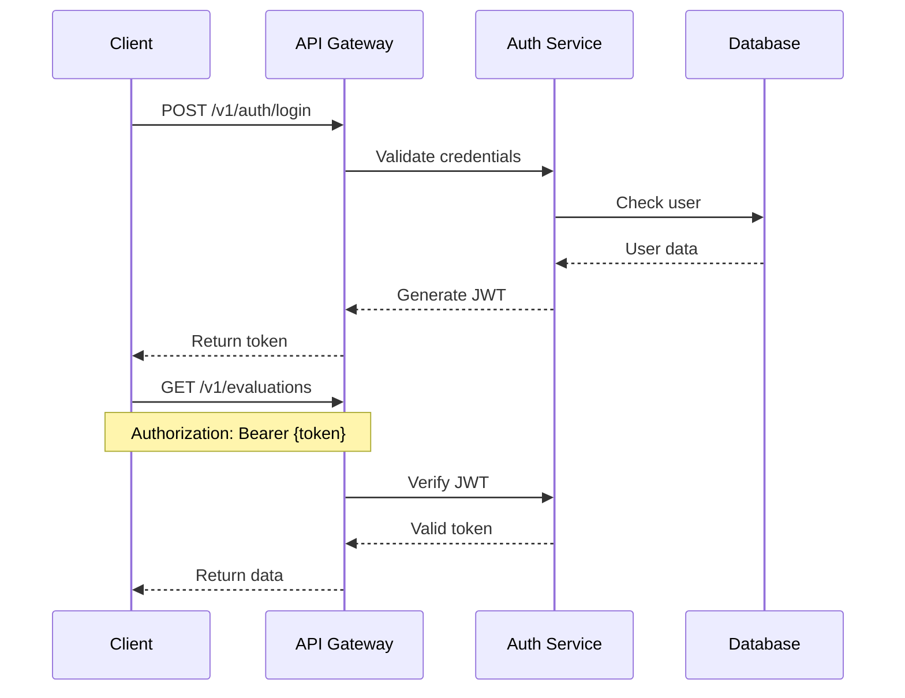

# API 设计文档

## 1. 概述

### 1.1 设计原则
- **RESTful 规范**: 遵循 REST 架构风格
- **版本控制**: URL 路径版本管理
- **一致性**: 统一的请求/响应格式
- **安全性**: JWT 认证、限流保护
- **性能优化**: 缓存、分页、懒加载
- **错误处理**: 标准化错误响应

### 1.2 技术栈
- **框架**: Hono 4.0 (轻量级、高性能)
- **运行时**: Cloudflare Workers
- **验证**: Zod (运行时类型检查)
- **认证**: JWT + Cloudflare Access
- **文档**: OpenAPI 3.0 规范
- **实时通信**: WebSocket (Durable Objects)

## 2. API 架构

### 2.1 基础配置

```typescript
// API 基础配置
const API_CONFIG = {
  version: 'v1',
  baseUrl: 'https://api.zhiji.ai',
  timeout: 30000, // 30秒
  rateLimit: {
    requests: 100,
    window: 60 // 每分钟100次
  },
  cors: {
    origin: ['https://zhiji.ai', 'https://preview.zhiji.ai'],
    credentials: true
  }
};
```

### 2.2 URL 结构

```
https://api.zhiji.ai/v1/{resource}/{id?}/{action?}

示例：
GET    /v1/evaluations          # 获取评估列表
POST   /v1/evaluations          # 创建评估
GET    /v1/evaluations/123      # 获取特定评估
PUT    /v1/evaluations/123      # 更新评估
DELETE /v1/evaluations/123      # 删除评估
POST   /v1/evaluations/123/share # 分享评估
```

## 3. 认证与授权

### 3.1 认证流程



### 3.2 JWT Token 结构

```typescript
interface JWTPayload {
  // 标准声明
  sub: string;      // userId
  iat: number;      // 签发时间
  exp: number;      // 过期时间
  
  // 自定义声明
  email: string;
  role: 'user' | 'vip' | 'admin';
  permissions: string[];
  sessionId: string;
}

// Token 生成
const generateToken = (user: User): string => {
  return jwt.sign({
    sub: user.id,
    email: user.email,
    role: user.role,
    permissions: getPermissions(user.role),
    sessionId: crypto.randomUUID(),
    iat: Math.floor(Date.now() / 1000),
    exp: Math.floor(Date.now() / 1000) + (24 * 60 * 60) // 24小时
  }, JWT_SECRET);
};
```

### 3.3 权限控制

```typescript
// RBAC 权限矩阵
const PERMISSIONS = {
  user: [
    'evaluation:create',
    'evaluation:read:own',
    'evaluation:update:own',
    'evaluation:delete:own',
    'report:generate:own'
  ],
  vip: [
    ...PERMISSIONS.user,
    'evaluation:unlimited',
    'report:export',
    'api:priority'
  ],
  admin: [
    ...PERMISSIONS.vip,
    'evaluation:read:all',
    'evaluation:update:all',
    'evaluation:delete:all',
    'user:manage',
    'system:configure'
  ]
};

// 中间件实现
const requirePermission = (permission: string) => {
  return async (c: Context, next: Next) => {
    const user = c.get('user');
    if (!user.permissions.includes(permission)) {
      return c.json({ error: 'Forbidden' }, 403);
    }
    await next();
  };
};
```

## 4. 核心 API 端点

### 4.1 认证相关

#### 登录
```typescript
POST /v1/auth/login
Content-Type: application/json

Request:
{
  "email": "user@example.com",
  "password": "password123"
}

Response (200):
{
  "success": true,
  "data": {
    "token": "eyJhbGciOiJIUzI1NiIs...",
    "refreshToken": "refresh_token_here",
    "user": {
      "id": "user_123",
      "email": "user@example.com",
      "name": "张三",
      "role": "user",
      "credits": 10
    }
  }
}
```

#### 刷新 Token
```typescript
POST /v1/auth/refresh
Content-Type: application/json

Request:
{
  "refreshToken": "refresh_token_here"
}

Response (200):
{
  "success": true,
  "data": {
    "token": "new_jwt_token",
    "refreshToken": "new_refresh_token"
  }
}
```

### 4.2 评估相关

#### 创建评估
```typescript
POST /v1/evaluations
Authorization: Bearer {token}
Content-Type: application/json

Request:
{
  "projectName": "智能客服系统",
  "description": "基于大模型的智能客服，自动回答用户问题",
  "targetUsers": "企业客服团队",
  "modelId": "gpt-5",
  "features": ["多轮对话", "情感分析", "知识库检索"],
  "constraints": ["响应时间<2s", "准确率>90%"]
}

Response (202):
{
  "success": true,
  "data": {
    "evaluationId": "eval_abc123",
    "status": "processing",
    "estimatedTime": 5000,
    "message": "评估已开始，请稍后查询结果"
  }
}
```

#### 获取评估结果
```typescript
GET /v1/evaluations/{evaluationId}
Authorization: Bearer {token}

Response (200):
{
  "success": true,
  "data": {
    "id": "eval_abc123",
    "projectName": "智能客服系统",
    "status": "completed",
    "totalScore": 86,
    "dimensions": {
      "clarity": 90,
      "capability": 85,
      "objectivity": 80,
      "data": 88,
      "tolerance": 87
    },
    "matrixPosition": {
      "x": 75,
      "y": 60,
      "zone": "optimal"
    },
    "suggestions": [
      "建议先从小规模试点开始",
      "需要准备充足的训练数据",
      "考虑引入人工审核机制"
    ],
    "risks": [
      "模型可能产生不准确的内容",
      "需要持续的维护和优化"
    ],
    "roi": {
      "developmentCost": 50000,
      "operationalCost": 5000,
      "expectedBenefit": 20000,
      "paybackPeriod": 4
    },
    "createdAt": "2025-01-20T10:30:00Z",
    "completedAt": "2025-01-20T10:30:05Z"
  }
}
```

#### 获取评估列表
```typescript
GET /v1/evaluations?page=1&limit=10&status=completed&sort=-createdAt
Authorization: Bearer {token}

Response (200):
{
  "success": true,
  "data": [
    {
      "id": "eval_abc123",
      "projectName": "智能客服系统",
      "totalScore": 86,
      "status": "completed",
      "createdAt": "2025-01-20T10:30:00Z"
    }
  ],
  "pagination": {
    "page": 1,
    "limit": 10,
    "total": 25,
    "totalPages": 3
  }
}
```

### 4.3 案例库

#### 获取热门案例
```typescript
GET /v1/cases/hot?limit=10

Response (200):
{
  "success": true,
  "data": [
    {
      "id": "eval_def456",
      "projectName": "代码审查助手",
      "description": "自动审查代码质量，提供改进建议",
      "totalScore": 92,
      "zone": "optimal",
      "author": {
        "name": "李四",
        "avatar": "https://..."
      },
      "metrics": {
        "views": 1580,
        "likes": 234,
        "shares": 45
      },
      "tags": ["代码质量", "自动化", "开发工具"],
      "createdAt": "2025-01-19T15:20:00Z"
    }
  ]
}
```

#### 获取精选案例
```typescript
GET /v1/cases/featured

Response (200):
{
  "success": true,
  "data": [
    {
      "id": "eval_ghi789",
      "projectName": "智能写作助手",
      "description": "帮助用户生成高质量文章",
      "totalScore": 95,
      "zone": "optimal",
      "badge": "精选",
      "summary": "该项目展示了如何构建一个高效的写作辅助工具...",
      "highlights": [
        "清晰的任务定义",
        "优秀的评估指标",
        "完整的实施方案"
      ]
    }
  ]
}
```

### 4.4 报告生成

#### 生成 PDF 报告
```typescript
POST /v1/reports/generate
Authorization: Bearer {token}
Content-Type: application/json

Request:
{
  "evaluationId": "eval_abc123",
  "format": "pdf",
  "language": "zh-CN",
  "includeDetails": true
}

Response (202):
{
  "success": true,
  "data": {
    "reportId": "report_xyz789",
    "status": "generating",
    "estimatedTime": 3000
  }
}
```

#### 下载报告
```typescript
GET /v1/reports/{reportId}/download
Authorization: Bearer {token}

Response (200):
Content-Type: application/pdf
Content-Disposition: attachment; filename="evaluation-report.pdf"

[Binary PDF data]
```

## 5. WebSocket 实时通信

### 5.1 连接建立

```typescript
// WebSocket 连接
const ws = new WebSocket('wss://ws.zhiji.ai/v1/live');

// 认证
ws.onopen = () => {
  ws.send(JSON.stringify({
    type: 'auth',
    token: 'jwt_token_here'
  }));
};

// 订阅频道
ws.send(JSON.stringify({
  type: 'subscribe',
  channels: ['evaluations', 'notifications']
}));
```

### 5.2 消息格式

```typescript
interface WebSocketMessage {
  type: 'auth' | 'subscribe' | 'message' | 'error';
  channel?: string;
  data?: any;
  timestamp: number;
}

// 实时评估更新
{
  "type": "message",
  "channel": "evaluations",
  "data": {
    "event": "evaluation.started",
    "evaluationId": "eval_abc123",
    "user": "张三",
    "project": "智能客服系统"
  },
  "timestamp": 1705750200000
}

// 系统通知
{
  "type": "message",
  "channel": "notifications",
  "data": {
    "event": "system.maintenance",
    "message": "系统将于10分钟后进行维护",
    "severity": "warning"
  },
  "timestamp": 1705750200000
}
```

### 5.3 心跳机制

```typescript
// 客户端心跳
setInterval(() => {
  ws.send(JSON.stringify({
    type: 'ping',
    timestamp: Date.now()
  }));
}, 30000); // 每30秒

// 服务端响应
{
  "type": "pong",
  "timestamp": 1705750200000
}
```

## 6. 错误处理

### 6.1 错误响应格式

```typescript
interface ErrorResponse {
  success: false;
  error: {
    code: string;
    message: string;
    details?: any;
    traceId?: string;
  };
  timestamp: number;
}

// 示例错误响应
{
  "success": false,
  "error": {
    "code": "VALIDATION_ERROR",
    "message": "请求参数验证失败",
    "details": {
      "projectName": "项目名称不能为空",
      "description": "描述长度必须在10-1000字符之间"
    },
    "traceId": "trace_abc123"
  },
  "timestamp": 1705750200000
}
```

### 6.2 错误码定义

| 错误码 | HTTP状态码 | 说明 |
|--------|-----------|------|
| VALIDATION_ERROR | 400 | 请求参数验证失败 |
| AUTHENTICATION_REQUIRED | 401 | 需要身份认证 |
| INVALID_TOKEN | 401 | Token无效或过期 |
| PERMISSION_DENIED | 403 | 权限不足 |
| NOT_FOUND | 404 | 资源不存在 |
| RATE_LIMITED | 429 | 请求频率超限 |
| INTERNAL_ERROR | 500 | 服务器内部错误 |
| SERVICE_UNAVAILABLE | 503 | 服务暂时不可用 |
| AI_SERVICE_ERROR | 502 | AI服务调用失败 |
| INSUFFICIENT_CREDITS | 402 | 额度不足 |

### 6.3 错误处理中间件

```typescript
// 全局错误处理
app.onError((err, c) => {
  console.error(`${err}`);
  
  if (err instanceof ValidationError) {
    return c.json({
      success: false,
      error: {
        code: 'VALIDATION_ERROR',
        message: err.message,
        details: err.errors
      }
    }, 400);
  }
  
  if (err instanceof AuthError) {
    return c.json({
      success: false,
      error: {
        code: 'AUTHENTICATION_REQUIRED',
        message: 'Authentication required'
      }
    }, 401);
  }
  
  // 默认错误响应
  return c.json({
    success: false,
    error: {
      code: 'INTERNAL_ERROR',
      message: 'An unexpected error occurred',
      traceId: c.get('traceId')
    }
  }, 500);
});
```

## 7. 限流策略

### 7.1 限流规则

```typescript
const RATE_LIMITS = {
  // 全局限制
  global: { requests: 1000, window: 60 },
  
  // 端点限制
  endpoints: {
    'POST /v1/evaluations': { requests: 10, window: 3600 }, // 每小时10次
    'POST /v1/auth/login': { requests: 5, window: 300 },    // 每5分钟5次
    'GET /v1/evaluations': { requests: 100, window: 60 },   // 每分钟100次
  },
  
  // 角色限制
  roles: {
    user: { requests: 100, window: 3600 },     // 每小时100次
    vip: { requests: 1000, window: 3600 },     // 每小时1000次
    admin: { requests: 10000, window: 3600 }   // 每小时10000次
  }
};
```

### 7.2 限流实现

```typescript
const rateLimitMiddleware = async (c: Context, next: Next) => {
  const userId = c.get('userId');
  const endpoint = `${c.req.method} ${c.req.path}`;
  
  // 检查端点限制
  const endpointLimit = RATE_LIMITS.endpoints[endpoint];
  if (endpointLimit) {
    const key = `ratelimit:endpoint:${userId}:${endpoint}`;
    const count = await incrementCounter(key, endpointLimit.window);
    
    if (count > endpointLimit.requests) {
      return c.json({
        success: false,
        error: {
          code: 'RATE_LIMITED',
          message: 'Too many requests',
          retryAfter: endpointLimit.window
        }
      }, 429);
    }
  }
  
  await next();
};
```

## 8. 缓存策略

### 8.1 缓存配置

```typescript
const CACHE_CONFIG = {
  // 公共资源缓存
  public: {
    'GET /v1/cases/hot': { ttl: 300, staleWhileRevalidate: 60 },
    'GET /v1/cases/featured': { ttl: 600, staleWhileRevalidate: 120 }
  },
  
  // 私有资源缓存
  private: {
    'GET /v1/evaluations': { ttl: 60 },
    'GET /v1/evaluations/:id': { ttl: 300 }
  }
};
```

### 8.2 缓存实现

```typescript
const cacheMiddleware = async (c: Context, next: Next) => {
  const cacheKey = `cache:${c.req.method}:${c.req.url}`;
  const cached = await env.KV.get(cacheKey, 'json');
  
  if (cached) {
    c.header('X-Cache', 'HIT');
    return c.json(cached);
  }
  
  await next();
  
  // 缓存响应
  if (c.res.status === 200) {
    const body = await c.res.json();
    await env.KV.put(cacheKey, JSON.stringify(body), {
      expirationTtl: getCacheTTL(c.req.path)
    });
  }
};
```

## 9. API 版本管理

### 9.1 版本策略

```typescript
// URL路径版本
/v1/evaluations  // 当前版本
/v2/evaluations  // 新版本

// Header版本（备选）
X-API-Version: 1.0

// 版本兼容性
const API_VERSIONS = {
  v1: { 
    deprecated: false, 
    sunset: null,
    features: ['basic', 'reports'] 
  },
  v2: { 
    deprecated: false, 
    sunset: null,
    features: ['basic', 'reports', 'ai-insights', 'batch'] 
  }
};
```

### 9.2 版本迁移

```typescript
// 版本兼容层
class VersionAdapter {
  static adaptRequest(version: string, data: any): any {
    if (version === 'v1') {
      // v1 到 v2 的适配
      return {
        ...data,
        modelId: data.model || 'gpt-5' // v1使用model，v2使用modelId
      };
    }
    return data;
  }
  
  static adaptResponse(version: string, data: any): any {
    if (version === 'v1') {
      // v2 到 v1 的适配
      const { modelId, ...rest } = data;
      return {
        ...rest,
        model: modelId // v2的modelId转换为v1的model
      };
    }
    return data;
  }
}
```

## 10. API 监控

### 10.1 监控指标

```typescript
interface APIMetrics {
  // 请求统计
  requests: {
    total: number;
    success: number;
    errors: number;
    errorRate: number;
  };
  
  // 性能指标
  performance: {
    avgLatency: number;    // ms
    p50Latency: number;
    p95Latency: number;
    p99Latency: number;
  };
  
  // 业务指标
  business: {
    evaluationsCreated: number;
    reportsGenerated: number;
    activeUsers: number;
  };
}
```

### 10.2 监控实现

```typescript
const metricsMiddleware = async (c: Context, next: Next) => {
  const start = Date.now();
  const traceId = crypto.randomUUID();
  
  c.set('traceId', traceId);
  
  try {
    await next();
    
    // 记录成功请求
    await recordMetric({
      traceId,
      method: c.req.method,
      path: c.req.path,
      status: c.res.status,
      latency: Date.now() - start,
      userId: c.get('userId')
    });
  } catch (error) {
    // 记录错误
    await recordError({
      traceId,
      error: error.message,
      stack: error.stack,
      context: {
        method: c.req.method,
        path: c.req.path,
        userId: c.get('userId')
      }
    });
    throw error;
  }
};
```

## 11. API 文档

### 11.1 OpenAPI 规范

```yaml
openapi: 3.0.0
info:
  title: 知几 API
  version: 1.0.0
  description: AI Agent 可行性评估平台 API
servers:
  - url: https://api.zhiji.ai/v1
    description: 生产环境
  - url: https://api-staging.zhiji.ai/v1
    description: 预发布环境
paths:
  /evaluations:
    post:
      summary: 创建评估
      tags: [Evaluations]
      security:
        - bearerAuth: []
      requestBody:
        required: true
        content:
          application/json:
            schema:
              $ref: '#/components/schemas/CreateEvaluation'
      responses:
        '202':
          description: 评估创建成功
          content:
            application/json:
              schema:
                $ref: '#/components/schemas/EvaluationResponse'
```

### 11.2 SDK 生成

```typescript
// TypeScript SDK 自动生成
export class ZhiJiAPI {
  constructor(private apiKey: string) {}
  
  async createEvaluation(data: CreateEvaluationRequest): Promise<EvaluationResponse> {
    return this.request('POST', '/evaluations', data);
  }
  
  async getEvaluation(id: string): Promise<Evaluation> {
    return this.request('GET', `/evaluations/${id}`);
  }
}
```

## 12. 测试支持

### 12.1 测试端点

```typescript
// 健康检查
GET /v1/health

Response (200):
{
  "status": "healthy",
  "version": "1.0.0",
  "timestamp": 1705750200000
}

// 测试认证
POST /v1/test/auth
Authorization: Bearer {token}

Response (200):
{
  "valid": true,
  "user": {
    "id": "user_123",
    "role": "user"
  }
}
```

### 12.2 沙箱环境

```typescript
// 沙箱配置
const SANDBOX_CONFIG = {
  url: 'https://sandbox-api.zhiji.ai/v1',
  testApiKey: 'test_key_xxx',
  resetEndpoint: '/sandbox/reset',
  mockData: true
};
```

## 13. 文档维护

**版本**: v1.0.0  
**最后更新**: 2025年1月  
**下次评审**: 2025年2月  
**负责人**: API 架构师