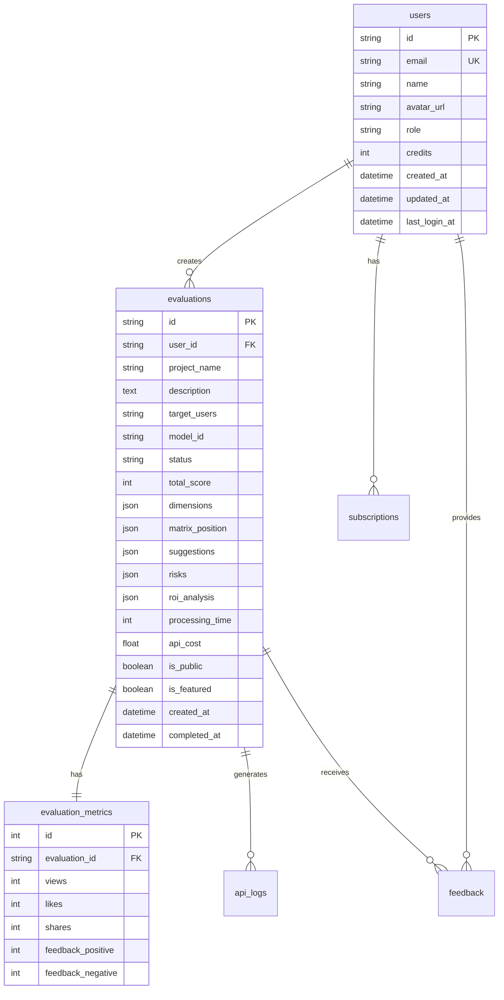

# 数据库设计文档

## 1. 概述

### 1.1 设计原则
- **边缘优先**: 充分利用 Cloudflare 边缘数据库特性
- **性能优化**: 合理使用索引和缓存策略
- **成本效益**: 优化存储和查询成本
- **可扩展性**: 支持未来功能扩展
- **数据安全**: 敏感数据加密存储

### 1.2 存储方案选择

| 存储类型 | 使用场景 | 特点 |
|---------|---------|------|
| D1 Database | 结构化数据、关系型数据 | SQLite兼容、ACID事务、低延迟 |
| KV Store | 缓存、会话、计数器 | 键值对、高性能读取、全球复制 |
| R2 Storage | 文件存储、备份、报告 | 对象存储、S3兼容、成本低 |
| Durable Objects | 实时状态、WebSocket | 有状态、强一致性、实时通信 |
| Queues | 异步任务、事件处理 | 消息队列、可靠传递、自动重试 |

## 2. D1 Database 设计

### 2.1 数据模型架构



### 2.2 核心表设计

#### users 表
```sql
CREATE TABLE users (
    id TEXT PRIMARY KEY DEFAULT (lower(hex(randomblob(16)))),
    email TEXT UNIQUE NOT NULL,
    name TEXT,
    avatar_url TEXT,
    role TEXT DEFAULT 'user' CHECK(role IN ('user', 'vip', 'admin')),
    credits INTEGER DEFAULT 10,
    created_at DATETIME DEFAULT CURRENT_TIMESTAMP,
    updated_at DATETIME DEFAULT CURRENT_TIMESTAMP,
    last_login_at DATETIME,
    deleted_at DATETIME -- 软删除
);

-- 索引优化
CREATE INDEX idx_users_email ON users(email);
CREATE INDEX idx_users_role ON users(role) WHERE role != 'user';
CREATE INDEX idx_users_created_at ON users(created_at);
CREATE INDEX idx_users_deleted_at ON users(deleted_at) WHERE deleted_at IS NULL;
```

#### evaluations 表
```sql
CREATE TABLE evaluations (
    id TEXT PRIMARY KEY DEFAULT (lower(hex(randomblob(16)))),
    user_id TEXT REFERENCES users(id),
    project_name TEXT NOT NULL,
    description TEXT NOT NULL,
    target_users TEXT,
    model_id TEXT NOT NULL,
    status TEXT DEFAULT 'pending' CHECK(status IN ('pending', 'processing', 'completed', 'failed')),
    total_score INTEGER CHECK(total_score >= 0 AND total_score <= 100),
    dimensions TEXT, -- JSON: {clarity, capability, objectivity, data, tolerance}
    matrix_position TEXT, -- JSON: {x, y, zone}
    suggestions TEXT, -- JSON array
    risks TEXT, -- JSON array
    roi_analysis TEXT, -- JSON: {developmentCost, operationalCost, expectedBenefit, paybackPeriod}
    processing_time INTEGER, -- milliseconds
    api_cost REAL,
    is_public BOOLEAN DEFAULT 0,
    is_featured BOOLEAN DEFAULT 0,
    created_at DATETIME DEFAULT CURRENT_TIMESTAMP,
    completed_at DATETIME,
    updated_at DATETIME DEFAULT CURRENT_TIMESTAMP
);

-- 复合索引优化查询性能
CREATE INDEX idx_evaluations_user_status ON evaluations(user_id, status);
CREATE INDEX idx_evaluations_public_featured ON evaluations(is_public, is_featured, total_score DESC) WHERE is_public = 1;
CREATE INDEX idx_evaluations_created_at ON evaluations(created_at DESC);
CREATE INDEX idx_evaluations_model_status ON evaluations(model_id, status);
```

#### evaluation_metrics 表
```sql
CREATE TABLE evaluation_metrics (
    id INTEGER PRIMARY KEY AUTOINCREMENT,
    evaluation_id TEXT UNIQUE NOT NULL REFERENCES evaluations(id) ON DELETE CASCADE,
    views INTEGER DEFAULT 0,
    likes INTEGER DEFAULT 0,
    shares INTEGER DEFAULT 0,
    feedback_positive INTEGER DEFAULT 0,
    feedback_negative INTEGER DEFAULT 0,
    updated_at DATETIME DEFAULT CURRENT_TIMESTAMP
);

-- 触发器自动更新时间戳
CREATE TRIGGER update_metrics_timestamp 
AFTER UPDATE ON evaluation_metrics
BEGIN
    UPDATE evaluation_metrics SET updated_at = CURRENT_TIMESTAMP WHERE id = NEW.id;
END;
```

#### api_logs 表
```sql
CREATE TABLE api_logs (
    id INTEGER PRIMARY KEY AUTOINCREMENT,
    user_id TEXT REFERENCES users(id),
    evaluation_id TEXT REFERENCES evaluations(id),
    model_id TEXT NOT NULL,
    endpoint TEXT,
    request_tokens INTEGER,
    response_tokens INTEGER,
    cost REAL,
    latency INTEGER, -- milliseconds
    status TEXT CHECK(status IN ('success', 'error', 'timeout')),
    error_message TEXT,
    created_at DATETIME DEFAULT CURRENT_TIMESTAMP
);

-- 分区索引用于日志查询
CREATE INDEX idx_api_logs_date_user ON api_logs(date(created_at), user_id);
CREATE INDEX idx_api_logs_model_date ON api_logs(model_id, date(created_at));
CREATE INDEX idx_api_logs_status ON api_logs(status) WHERE status = 'error';
```

#### subscriptions 表
```sql
CREATE TABLE subscriptions (
    id TEXT PRIMARY KEY DEFAULT (lower(hex(randomblob(16)))),
    user_id TEXT UNIQUE NOT NULL REFERENCES users(id),
    plan TEXT NOT NULL CHECK(plan IN ('free', 'pro', 'enterprise')),
    credits_monthly INTEGER,
    credits_used INTEGER DEFAULT 0,
    price_monthly REAL,
    status TEXT DEFAULT 'active' CHECK(status IN ('active', 'cancelled', 'expired', 'suspended')),
    payment_method TEXT,
    stripe_customer_id TEXT,
    stripe_subscription_id TEXT,
    started_at DATETIME DEFAULT CURRENT_TIMESTAMP,
    expires_at DATETIME,
    cancelled_at DATETIME,
    updated_at DATETIME DEFAULT CURRENT_TIMESTAMP
);

CREATE INDEX idx_subscriptions_status ON subscriptions(status, expires_at);
CREATE INDEX idx_subscriptions_user ON subscriptions(user_id);
```

### 2.3 数据库优化策略

#### 查询优化
```sql
-- 使用覆盖索引优化热门案例查询
CREATE INDEX idx_hot_cases ON evaluations(is_public, total_score DESC, created_at DESC) 
WHERE is_public = 1
INCLUDE (project_name, description, model_id);

-- 使用部分索引优化状态查询
CREATE INDEX idx_pending_evaluations ON evaluations(status, created_at) 
WHERE status IN ('pending', 'processing');
```

#### 数据归档策略
```sql
-- 创建归档表
CREATE TABLE evaluations_archive (
    LIKE evaluations INCLUDING ALL
);

-- 定期归档旧数据（超过6个月）
INSERT INTO evaluations_archive 
SELECT * FROM evaluations 
WHERE created_at < datetime('now', '-6 months');

DELETE FROM evaluations 
WHERE created_at < datetime('now', '-6 months');
```

## 3. KV Store 设计

### 3.1 命名空间规划

```typescript
interface KVNamespaces {
  // 评估缓存 - TTL: 1小时
  EVALUATION_CACHE: {
    key: `eval:${modelId}:${hash(projectData)}`;
    value: EvaluationResult;
    metadata: {
      created: number;
      hits: number;
    };
  };
  
  // 用户会话 - TTL: 24小时
  USER_SESSION: {
    key: `session:${sessionId}`;
    value: {
      userId: string;
      email: string;
      role: string;
      expires: number;
    };
  };
  
  // 限流计数 - TTL: 滑动窗口
  RATE_LIMIT: {
    key: `ratelimit:${userId}:${resource}:${window}`;
    value: number;
  };
  
  // 热门数据缓存 - TTL: 5分钟
  HOT_DATA: {
    key: `hot:${type}:${page}`;
    value: Array<any>;
  };
  
  // 特性开关 - 无TTL
  FEATURE_FLAGS: {
    key: `feature:${flagName}`;
    value: {
      enabled: boolean;
      rollout: number; // 0-100
      whitelist: string[];
    };
  };
}
```

### 3.2 缓存策略

```typescript
class CacheStrategy {
  // 分层缓存
  static readonly CACHE_LAYERS = {
    L1_MEMORY: { maxSize: 100, ttl: 60 },      // 内存缓存
    L2_KV: { maxSize: 10000, ttl: 3600 },      // KV缓存
    L3_D1: { maxSize: Infinity, ttl: 86400 }   // 数据库缓存
  };
  
  // 缓存键生成
  static generateKey(type: string, params: any): string {
    const sorted = Object.keys(params).sort().reduce((acc, key) => {
      acc[key] = params[key];
      return acc;
    }, {});
    return `${type}:${crypto.createHash('sha256').update(JSON.stringify(sorted)).digest('hex')}`;
  }
  
  // 缓存预热
  static async warmup(kv: KVNamespace) {
    const hotCases = await db.query('SELECT * FROM evaluations WHERE is_featured = 1');
    await kv.put('hot:featured', JSON.stringify(hotCases), { expirationTtl: 300 });
  }
}
```

## 4. R2 Storage 结构

### 4.1 目录结构设计

```
zhiji-storage/
├── reports/                    # 评估报告
│   ├── pdf/                   # PDF格式报告
│   │   └── {yyyy-mm}/
│   │       └── {evaluationId}.pdf
│   └── exports/                # 导出数据
│       └── {yyyy-mm}/
│           └── {userId}/
│               └── evaluations-{timestamp}.csv
│
├── assets/                     # 静态资源
│   ├── images/
│   │   ├── matrix/            # 矩阵图片
│   │   └── avatars/           # 用户头像
│   └── documents/              # 文档资源
│
├── backups/                    # 数据备份
│   ├── daily/
│   │   └── {yyyy-mm-dd}/
│   │       ├── d1-backup.sql
│   │       └── kv-export.json
│   └── weekly/
│       └── {yyyy-ww}/
│           └── full-backup.tar.gz
│
└── temp/                       # 临时文件
    └── {taskId}/
        └── processing-{timestamp}.json
```

### 4.2 存储策略

```typescript
interface R2StoragePolicy {
  // 生命周期管理
  lifecycle: {
    reports: { deleteAfterDays: 90 },      // 报告保留90天
    exports: { deleteAfterDays: 30 },      // 导出保留30天
    backups: { 
      daily: { deleteAfterDays: 7 },       // 日备份保留7天
      weekly: { deleteAfterDays: 30 }      // 周备份保留30天
    },
    temp: { deleteAfterDays: 1 }           // 临时文件1天后删除
  };
  
  // 访问控制
  acl: {
    reports: 'private',                     // 私有访问
    assets: 'public-read',                  // 公开读取
    backups: 'private',                     // 私有访问
    temp: 'private'                         // 私有访问
  };
  
  // 加密策略
  encryption: {
    reports: true,                          // 加密存储
    backups: true,                          // 加密存储
    assets: false,                          // 不加密
    temp: false                             // 不加密
  };
}
```

## 5. Durable Objects 设计

### 5.1 WebSocket 状态管理

```typescript
export class WebSocketRoom implements DurableObject {
  private sessions: Map<string, WebSocket> = new Map();
  private state: DurableObjectState;
  
  constructor(state: DurableObjectState) {
    this.state = state;
  }
  
  async fetch(request: Request): Promise<Response> {
    const upgradeHeader = request.headers.get('Upgrade');
    if (upgradeHeader !== 'websocket') {
      return new Response('Expected websocket', { status: 400 });
    }
    
    const [client, server] = Object.values(new WebSocketPair());
    await this.handleSession(server, request);
    
    return new Response(null, {
      status: 101,
      webSocket: client,
    });
  }
  
  async handleSession(ws: WebSocket, request: Request) {
    const sessionId = crypto.randomUUID();
    this.sessions.set(sessionId, ws);
    
    ws.addEventListener('message', async (event) => {
      await this.broadcast(event.data, sessionId);
    });
    
    ws.addEventListener('close', () => {
      this.sessions.delete(sessionId);
    });
  }
  
  async broadcast(message: string, excludeSession?: string) {
    const promises = [];
    for (const [id, ws] of this.sessions) {
      if (id !== excludeSession) {
        promises.push(ws.send(message));
      }
    }
    await Promise.all(promises);
  }
}
```

### 5.2 实时评估状态

```typescript
export class EvaluationTracker implements DurableObject {
  private activeEvaluations: Map<string, EvaluationStatus> = new Map();
  
  async trackEvaluation(evaluationId: string, status: EvaluationStatus) {
    this.activeEvaluations.set(evaluationId, {
      ...status,
      timestamp: Date.now()
    });
    
    // 持久化到存储
    await this.state.storage.put(`eval:${evaluationId}`, status);
    
    // 广播状态更新
    await this.broadcastUpdate(evaluationId, status);
  }
  
  async getActiveEvaluations(): Promise<EvaluationStatus[]> {
    const now = Date.now();
    const active = [];
    
    for (const [id, status] of this.activeEvaluations) {
      // 清理超过5分钟的记录
      if (now - status.timestamp > 300000) {
        this.activeEvaluations.delete(id);
      } else {
        active.push(status);
      }
    }
    
    return active;
  }
}
```

## 6. 数据迁移策略

### 6.1 版本管理

```sql
-- 迁移版本表
CREATE TABLE schema_migrations (
    version INTEGER PRIMARY KEY,
    name TEXT NOT NULL,
    executed_at DATETIME DEFAULT CURRENT_TIMESTAMP
);

-- 示例迁移脚本
-- Migration: 001_initial_schema.sql
BEGIN TRANSACTION;

-- 创建表结构
CREATE TABLE IF NOT EXISTS users (...);
CREATE TABLE IF NOT EXISTS evaluations (...);

-- 记录迁移版本
INSERT INTO schema_migrations (version, name) VALUES (1, 'initial_schema');

COMMIT;
```

### 6.2 数据同步策略

```typescript
class DataMigration {
  // 增量同步
  async incrementalSync(since: Date) {
    const changes = await this.getChanges(since);
    
    for (const change of changes) {
      await this.applyChange(change);
    }
    
    await this.updateSyncTimestamp();
  }
  
  // 全量迁移
  async fullMigration() {
    // 1. 导出旧数据
    const oldData = await this.exportOldData();
    
    // 2. 转换数据格式
    const newData = await this.transformData(oldData);
    
    // 3. 批量导入
    await this.batchImport(newData);
    
    // 4. 验证数据完整性
    await this.validateMigration();
  }
}
```

## 7. 备份与恢复

### 7.1 自动备份策略

```typescript
class BackupService {
  // 每日备份任务
  async dailyBackup() {
    const date = new Date().toISOString().split('T')[0];
    
    // 备份 D1
    const d1Export = await this.exportD1();
    await env.R2.put(`backups/daily/${date}/d1-backup.sql`, d1Export);
    
    // 备份 KV
    const kvExport = await this.exportKV();
    await env.R2.put(`backups/daily/${date}/kv-export.json`, kvExport);
    
    // 清理旧备份
    await this.cleanOldBackups(7); // 保留7天
  }
  
  // 灾难恢复
  async restore(backupDate: string) {
    // 1. 验证备份完整性
    await this.validateBackup(backupDate);
    
    // 2. 停止写入操作
    await this.enableReadOnlyMode();
    
    // 3. 恢复数据
    await this.restoreD1(backupDate);
    await this.restoreKV(backupDate);
    
    // 4. 验证恢复结果
    await this.validateRestore();
    
    // 5. 恢复写入操作
    await this.disableReadOnlyMode();
  }
}
```

## 8. 性能监控

### 8.1 关键指标

```typescript
interface DatabaseMetrics {
  // 查询性能
  queryPerformance: {
    avgResponseTime: number;  // ms
    p95ResponseTime: number;  // ms
    p99ResponseTime: number;  // ms
    slowQueries: number;       // > 100ms
  };
  
  // 存储使用
  storageUsage: {
    d1Size: number;           // MB
    kvSize: number;           // MB
    r2Size: number;           // GB
    kvKeys: number;           // 键数量
  };
  
  // 操作统计
  operations: {
    reads: number;
    writes: number;
    deletes: number;
    cacheHits: number;
    cacheMisses: number;
  };
}
```

### 8.2 性能优化建议

| 优化项 | 策略 | 预期效果 |
|--------|------|----------|
| 查询优化 | 使用覆盖索引 | 减少 50% 查询时间 |
| 缓存策略 | 多级缓存 | 提升 80% 命中率 |
| 批量操作 | 事务批处理 | 减少 70% 写入时间 |
| 数据归档 | 定期归档旧数据 | 减少 30% 存储成本 |
| 连接池 | 复用数据库连接 | 减少 40% 连接开销 |

## 9. 安全措施

### 9.1 数据加密

```typescript
class DataEncryption {
  // 字段级加密
  async encryptField(value: string): Promise<string> {
    const key = await this.getDerivedKey();
    const encrypted = await crypto.subtle.encrypt(
      { name: 'AES-GCM', iv: this.generateIV() },
      key,
      new TextEncoder().encode(value)
    );
    return btoa(String.fromCharCode(...new Uint8Array(encrypted)));
  }
  
  // 透明加密层
  async transparentEncryption(query: string, params: any[]) {
    const sensitiveFields = ['email', 'payment_method', 'stripe_customer_id'];
    
    for (const field of sensitiveFields) {
      if (params.includes(field)) {
        params[field] = await this.encryptField(params[field]);
      }
    }
    
    return { query, params };
  }
}
```

### 9.2 访问控制

```sql
-- 行级安全策略
CREATE VIEW user_evaluations AS
SELECT * FROM evaluations
WHERE user_id = current_user_id()
   OR is_public = 1;

-- 数据脱敏
CREATE VIEW public_users AS
SELECT 
    id,
    SUBSTR(email, 1, 3) || '***' || SUBSTR(email, INSTR(email, '@')) as email,
    name,
    role,
    created_at
FROM users;
```

## 10. 文档维护

**版本**: v1.0.0  
**最后更新**: 2025年1月  
**下次评审**: 2025年2月  
**负责人**: 数据架构师