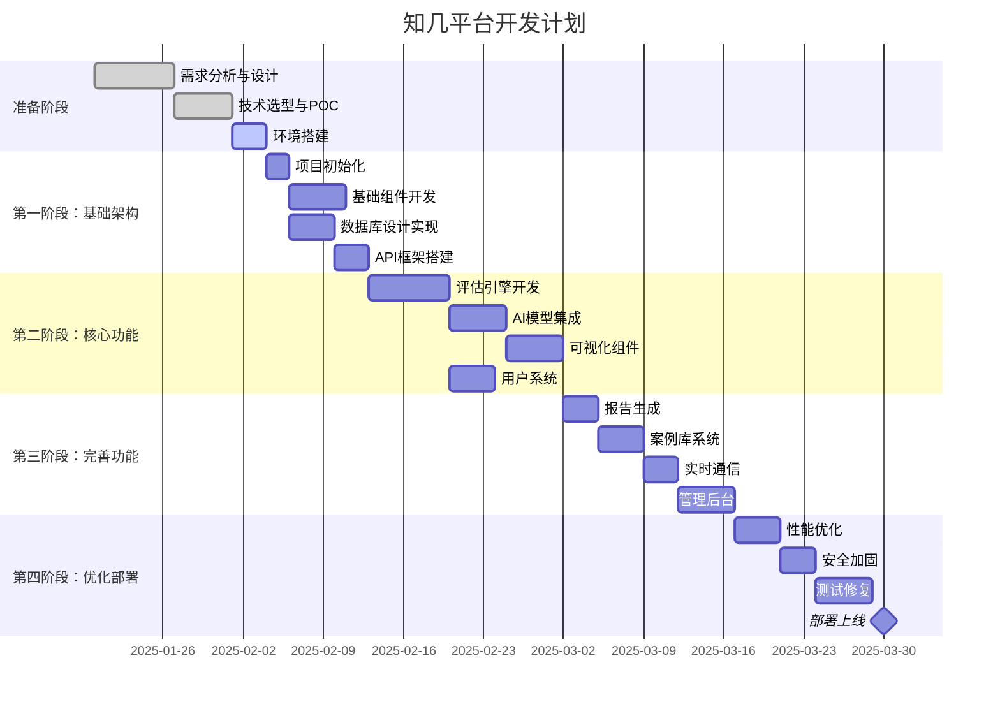
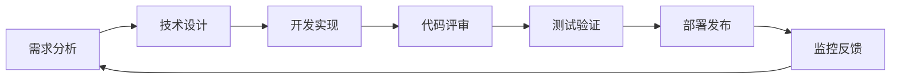
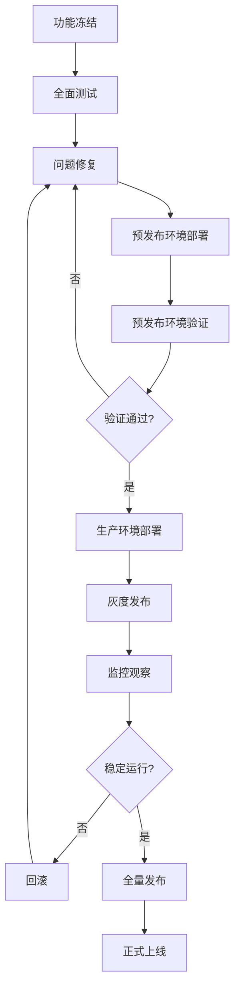

# 项目实施计划

## 1. 项目概述

### 1.1 项目信息
- **项目名称**: 知几（ZhiJi）AI Agent 可行性评估平台
- **项目周期**: 12周（3个月）
- **团队规模**: 5-8人
- **预算范围**: 30-50万人民币
- **目标上线**: 2025年4月

### 1.2 成功标准
- MVP版本按时上线
- 核心功能100%完成
- 性能指标达标（FCP<1.5s, API<500ms）
- 用户满意度>80%
- 月活用户达到1000+

## 2. 团队组织

### 2.1 团队结构

```
项目负责人（1人）
├── 技术负责人（1人）
│   ├── 前端开发（2人）
│   ├── 后端开发（2人）
│   └── DevOps（1人）
├── 产品经理（1人）
├── UI/UX设计师（1人）
└── 测试工程师（1人）
```

### 2.2 角色职责

| 角色 | 职责 | 技能要求 |
|------|------|----------|
| 项目负责人 | 整体规划、资源协调、风险管理 | 项目管理经验、沟通协调能力 |
| 技术负责人 | 技术架构、技术选型、代码评审 | 全栈开发经验、架构设计能力 |
| 前端开发 | React/Next.js开发、UI实现 | React、TypeScript、Tailwind CSS |
| 后端开发 | API开发、数据库设计、AI集成 | Node.js、Cloudflare Workers、SQL |
| DevOps | CI/CD、部署、监控 | Docker、GitHub Actions、Cloudflare |
| 产品经理 | 需求分析、产品设计、用户反馈 | 产品思维、数据分析 |
| UI/UX设计 | 界面设计、交互设计、设计系统 | Figma、设计系统、用户体验 |
| 测试工程师 | 测试计划、自动化测试、质量保证 | Jest、Playwright、性能测试 |

## 3. 开发阶段

### 3.1 项目时间线



### 3.2 里程碑计划

#### 第一阶段：基础架构（第1-3周）
**目标**: 搭建项目基础架构，完成核心技术验证

**交付物**:
- ✅ 项目代码仓库和CI/CD流程
- ✅ 基础UI组件库
- ✅ 数据库Schema和迁移脚本
- ✅ API基础框架和认证系统
- ✅ 开发环境和文档

**验收标准**:
- 所有基础组件可正常运行
- API健康检查通过
- 数据库连接正常
- CI/CD流程可自动执行

#### 第二阶段：核心功能（第4-7周）
**目标**: 实现核心评估功能，集成AI模型

**交付物**:
- ✅ 评估引擎核心逻辑
- ✅ 多模型AI集成
- ✅ 能力矩阵可视化
- ✅ 用户注册登录系统
- ✅ 基础评估流程

**验收标准**:
- 可完成完整的评估流程
- AI模型调用成功率>95%
- 可视化组件正确展示
- 用户系统功能完整

#### 第三阶段：完善功能（第8-10周）
**目标**: 完善产品功能，提升用户体验

**交付物**:
- ✅ PDF报告生成功能
- ✅ 案例库和精选系统
- ✅ WebSocket实时通信
- ✅ 管理后台基础功能
- ✅ 数据统计分析

**验收标准**:
- 报告生成成功率100%
- 案例展示正常
- 实时通信稳定
- 后台管理功能可用

#### 第四阶段：优化部署（第11-12周）
**目标**: 性能优化、安全加固、正式上线

**交付物**:
- ✅ 性能优化报告
- ✅ 安全审计报告
- ✅ 完整测试报告
- ✅ 生产环境部署
- ✅ 运维文档

**验收标准**:
- 性能指标全部达标
- 安全漏洞全部修复
- 测试覆盖率>80%
- 生产环境稳定运行

## 4. 具体任务分解

### 4.1 前端开发任务

```typescript
interface FrontendTasks {
  week1_3: [
    "Next.js项目初始化",
    "Tailwind CSS配置",
    "shadcn/ui组件集成",
    "基础布局组件",
    "路由配置"
  ];
  week4_7: [
    "评估表单页面",
    "结果展示页面",
    "SVG矩阵可视化",
    "用户登录注册页",
    "个人中心页面"
  ];
  week8_10: [
    "案例库页面",
    "报告下载功能",
    "实时动态组件",
    "搜索筛选功能",
    "响应式适配"
  ];
  week11_12: [
    "性能优化",
    "代码分割",
    "PWA支持",
    "错误边界处理",
    "生产构建优化"
  ];
}
```

### 4.2 后端开发任务

```typescript
interface BackendTasks {
  week1_3: [
    "Cloudflare Workers项目搭建",
    "Hono框架配置",
    "D1数据库初始化",
    "JWT认证实现",
    "基础API端点"
  ];
  week4_7: [
    "评估API实现",
    "AI模型集成",
    "缓存策略实现",
    "用户API",
    "限流中间件"
  ];
  week8_10: [
    "报告生成服务",
    "WebSocket服务",
    "队列处理",
    "文件存储服务",
    "数据统计API"
  ];
  week11_12: [
    "性能调优",
    "错误处理完善",
    "日志系统",
    "监控集成",
    "生产部署"
  ];
}
```

## 5. 技术实施细节

### 5.1 开发流程



### 5.2 分支策略

```bash
main
├── develop
│   ├── feature/user-auth
│   ├── feature/evaluation-engine
│   └── feature/visualization
├── staging
└── hotfix/critical-bug
```

### 5.3 代码规范

```javascript
// ESLint配置
{
  "extends": [
    "next/core-web-vitals",
    "plugin:@typescript-eslint/recommended"
  ],
  "rules": {
    "no-console": "warn",
    "no-unused-vars": "error",
    "@typescript-eslint/explicit-module-boundary-types": "error"
  }
}

// Prettier配置
{
  "semi": true,
  "singleQuote": true,
  "tabWidth": 2,
  "trailingComma": "es5"
}
```

## 6. 风险管理

### 6.1 风险识别与应对

| 风险类型 | 风险描述 | 概率 | 影响 | 应对措施 |
|---------|---------|------|------|----------|
| 技术风险 | Cloudflare服务限制 | 中 | 高 | 提前测试限制，准备备选方案 |
| 技术风险 | AI API不稳定 | 中 | 高 | 多模型备份，实现故障转移 |
| 进度风险 | 功能复杂度超预期 | 中 | 中 | 分阶段交付，优先核心功能 |
| 人员风险 | 关键人员离职 | 低 | 高 | 知识文档化，代码评审制度 |
| 成本风险 | API调用成本超支 | 中 | 中 | 实时监控，设置预算告警 |
| 质量风险 | 性能不达标 | 低 | 高 | 持续性能测试，早期优化 |
| 市场风险 | 竞品出现 | 中 | 中 | 快速迭代，差异化定位 |

### 6.2 风险监控机制

```typescript
class RiskMonitor {
  // 每日风险检查清单
  dailyChecklist = [
    "代码提交情况",
    "CI/CD运行状态",
    "API调用量和成本",
    "错误日志分析",
    "团队工作进度"
  ];
  
  // 每周风险评审
  weeklyReview = [
    "里程碑进度",
    "技术债务",
    "团队状态",
    "预算使用",
    "用户反馈"
  ];
  
  // 风险升级机制
  escalation = {
    low: "团队内部解决",
    medium: "上报技术负责人",
    high: "上报项目负责人",
    critical: "紧急会议决策"
  };
}
```

## 7. 质量保证

### 7.1 测试策略

| 测试类型 | 覆盖范围 | 工具 | 目标 |
|---------|---------|------|------|
| 单元测试 | 业务逻辑、工具函数 | Jest, Vitest | >80% |
| 集成测试 | API端点、数据库操作 | Supertest | >70% |
| E2E测试 | 关键用户流程 | Playwright | 核心流程100% |
| 性能测试 | API响应、页面加载 | Lighthouse, k6 | 达标率100% |
| 安全测试 | 认证、授权、输入验证 | OWASP ZAP | 0高危漏洞 |

### 7.2 代码质量指标

```typescript
interface QualityMetrics {
  code: {
    coverage: 80,        // 测试覆盖率
    duplication: 5,      // 代码重复率 <5%
    complexity: 10,      // 圈复杂度 <10
    maintainability: 'A' // 可维护性评级
  };
  performance: {
    fcp: 1500,          // First Contentful Paint <1.5s
    tti: 3000,          // Time to Interactive <3s
    apiResponse: 500,    // API响应时间 <500ms
    errorRate: 0.1      // 错误率 <0.1%
  };
  security: {
    vulnerabilities: 0,  // 安全漏洞数
    dependencies: 'updated', // 依赖更新状态
    secrets: 'encrypted'    // 密钥加密状态
  };
}
```

## 8. 资源需求

### 8.1 人力资源

| 阶段 | 前端 | 后端 | DevOps | 测试 | 设计 | 产品 | 总计 |
|------|------|------|--------|------|------|------|------|
| 第一阶段 | 2人 | 2人 | 1人 | 0人 | 1人 | 1人 | 7人 |
| 第二阶段 | 2人 | 2人 | 0.5人 | 1人 | 0.5人 | 1人 | 7人 |
| 第三阶段 | 2人 | 2人 | 0.5人 | 1人 | 0人 | 0.5人 | 6人 |
| 第四阶段 | 1人 | 1人 | 1人 | 2人 | 0人 | 0.5人 | 5.5人 |

### 8.2 基础设施资源

```yaml
development:
  - 开发服务器: 2台 (4核8G)
  - 测试数据库: D1 开发版
  - CI/CD: GitHub Actions (免费额度)
  - 域名: zhiji-dev.ai

staging:
  - Cloudflare Workers: 10M请求/月
  - D1 Database: 5GB
  - KV Storage: 1GB
  - R2 Storage: 10GB
  - 域名: staging.zhiji.ai

production:
  - Cloudflare Workers: 50M请求/月
  - D1 Database: 10GB
  - KV Storage: 10GB
  - R2 Storage: 100GB
  - CDN: Cloudflare全球网络
  - 域名: zhiji.ai
```

### 8.3 预算分配

| 项目 | 预算（万元） | 占比 | 说明 |
|------|------------|------|------|
| 人力成本 | 30 | 60% | 3个月团队薪资 |
| 基础设施 | 5 | 10% | 云服务、域名等 |
| AI API | 8 | 16% | OpenAI、Anthropic等 |
| 工具软件 | 2 | 4% | 开发工具、监控服务 |
| 推广运营 | 3 | 6% | 初期推广费用 |
| 预备金 | 2 | 4% | 应急备用 |
| **总计** | **50** | **100%** | - |

## 9. 沟通机制

### 9.1 会议安排

| 会议类型 | 频率 | 参与人 | 时长 | 目的 |
|---------|------|--------|------|------|
| 每日站会 | 每天 | 全体开发 | 15分钟 | 同步进度、问题 |
| 周例会 | 每周一 | 全体成员 | 1小时 | 周计划、问题讨论 |
| 需求评审 | 每周三 | 产品、开发 | 2小时 | 需求确认、澄清 |
| 技术评审 | 每周五 | 技术团队 | 1小时 | 技术方案、代码评审 |
| 里程碑评审 | 阶段末 | 全体+管理层 | 2小时 | 阶段总结、下阶段规划 |

### 9.2 文档管理

```
docs/
├── technical/          # 技术文档
│   ├── architecture/   # 架构设计
│   ├── api/           # API文档
│   └── database/      # 数据库文档
├── product/           # 产品文档
│   ├── prd/          # 需求文档
│   ├── design/       # 设计文档
│   └── user-guide/   # 用户指南
├── project/          # 项目文档
│   ├── plans/        # 计划文档
│   ├── reports/      # 进度报告
│   └── meeting/      # 会议纪要
└── operations/       # 运维文档
    ├── deployment/   # 部署文档
    ├── monitoring/   # 监控文档
    └── emergency/    # 应急预案
```

## 10. 上线计划

### 10.1 上线前检查清单

- [ ] **功能完整性**
  - [ ] 所有功能开发完成
  - [ ] 功能测试通过
  - [ ] 用户验收测试通过

- [ ] **性能达标**
  - [ ] 页面加载时间 <2s
  - [ ] API响应时间 <500ms
  - [ ] 并发支持 1000+

- [ ] **安全审核**
  - [ ] 安全漏洞扫描
  - [ ] 权限控制验证
  - [ ] 数据加密确认

- [ ] **运维准备**
  - [ ] 监控系统就绪
  - [ ] 日志系统配置
  - [ ] 备份策略实施
  - [ ] 应急预案制定

- [ ] **文档完善**
  - [ ] API文档
  - [ ] 部署文档
  - [ ] 运维手册
  - [ ] 用户指南

### 10.2 上线步骤



### 10.3 灰度发布策略

```typescript
const GrayReleaseStrategy = {
  // 第一阶段：内部测试
  phase1: {
    duration: '2天',
    traffic: '5%',
    users: '内部员工',
    rollback: '自动'
  },
  // 第二阶段：小范围测试
  phase2: {
    duration: '3天',
    traffic: '20%',
    users: '种子用户',
    rollback: '手动确认'
  },
  // 第三阶段：扩大范围
  phase3: {
    duration: '3天',
    traffic: '50%',
    users: '随机用户',
    rollback: '手动确认'
  },
  // 第四阶段：全量发布
  phase4: {
    duration: '持续',
    traffic: '100%',
    users: '所有用户',
    rollback: '紧急预案'
  }
};
```

## 11. 项目交付物

### 11.1 代码交付

- 前端代码仓库（包含完整提交历史）
- 后端代码仓库（包含完整提交历史）
- 配置文件和环境变量模板
- 数据库迁移脚本
- CI/CD配置文件

### 11.2 文档交付

- 技术架构文档
- API接口文档
- 数据库设计文档
- 部署运维手册
- 用户使用指南
- 测试报告

### 11.3 其他交付

- 域名和SSL证书
- 云服务账号权限
- 监控告警配置
- 备份恢复方案
- 应急响应预案

## 12. 成功指标

### 12.1 技术指标

| 指标 | 目标值 | 测量方法 |
|------|--------|----------|
| 系统可用性 | >99.9% | 监控系统 |
| 页面加载速度 | <2s | Lighthouse |
| API响应时间 | <500ms | APM工具 |
| 错误率 | <0.1% | 日志分析 |
| 代码测试覆盖率 | >80% | Jest报告 |

### 12.2 业务指标

| 指标 | 目标值 | 测量方法 |
|------|--------|----------|
| 月活跃用户 | 1000+ | Google Analytics |
| 用户留存率 | >40% | 数据分析 |
| 平均评估时间 | <30s | 业务日志 |
| 用户满意度 | >80% | 用户调研 |
| 付费转化率 | >5% | 业务数据 |

## 13. 后续规划

### 13.1 版本迭代计划

- **v1.1（上线后1个月）**
  - 批量评估功能
  - 更多AI模型支持
  - API开放

- **v1.2（上线后2个月）**
  - 团队协作功能
  - 高级数据分析
  - 插件系统

- **v2.0（上线后6个月）**
  - 多语言支持
  - 移动App
  - 企业版功能

### 13.2 运营维护

- 7×24小时监控
- 每周定期更新
- 月度性能优化
- 季度安全审计
- 用户反馈收集与改进

## 14. 文档维护

**版本**: v1.0.0  
**最后更新**: 2025年1月  
**下次评审**: 2025年2月  
**负责人**: 项目经理