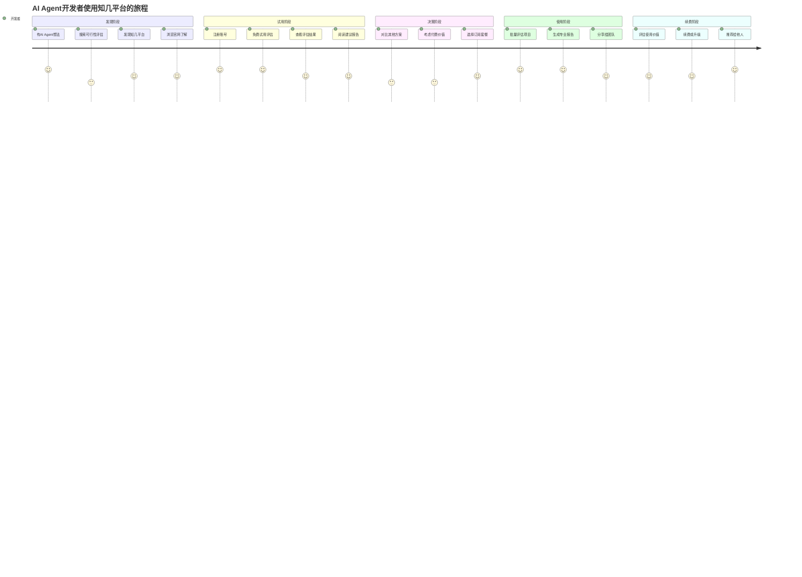
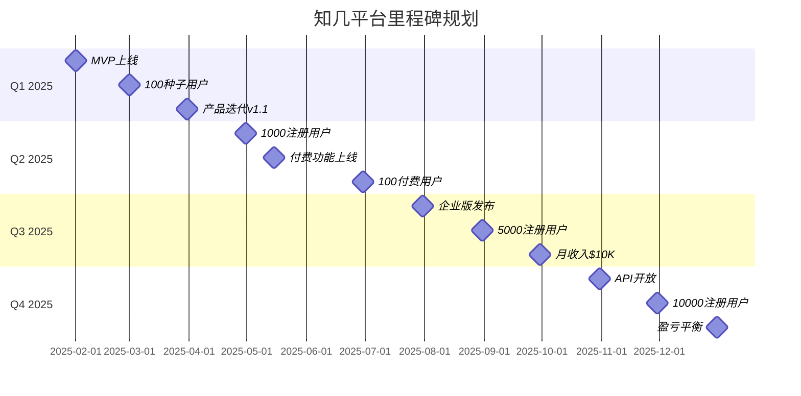
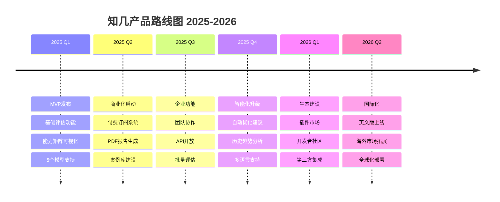

# 知几（ZhiJi）- AI Agent 可行性评估平台市场需求文档（MRD）

## 1. 文档信息

- **项目名称**: 知几（ZhiJi）
- **版本**: v1.0
- **日期**: 2025年1月
- **作者**: 市场战略团队
- **状态**: 初稿
- **相关文档**: 
  - agent-feasibility-evaluator-prd.md（产品需求文档）
  - zhiji-technical-requirements-document.md（技术需求文档）

## 2. 执行摘要

### 2.1 市场机会

AI Agent开发正处于爆发前夜。根据行业观察，当前超过80%的AI Agent项目因缺乏可行性评估而失败。企业和开发者急需一个专业的评估工具，在投入大量资源前判断项目可行性。

**核心洞察**：
- **痛点明确**：盲目开发导致资源浪费严重
- **市场空白**：缺少专业的AI Agent可行性评估工具
- **时机成熟**：LLM能力提升使评估成为可能
- **需求刚性**：评估是AI项目的必经环节

### 2.2 价值主张

"知几"帮助AI创新者在项目启动前洞察成败，将项目成功率从20%提升至80%以上。

### 2.3 商业目标

- **6个月目标**：1,000+ MAU，100+ 付费用户
- **12个月目标**：10,000+ MAU，1,000+ 付费用户
- **24个月目标**：成为AI Agent评估的行业标准

## 3. 市场分析

### 3.1 市场规模（TAM-SAM-SOM分析）

#### TAM（Total Addressable Market）- 总潜在市场
- **全球AI开发者**: 2,700万（2025年预测）
- **AI相关企业**: 50万+
- **潜在市场规模**: $15B（假设每用户年均$500）

#### SAM（Serviceable Available Market）- 可服务市场
- **AI Agent开发者**: 270万（约10%的AI开发者）
- **正在探索AI Agent的企业**: 5万+
- **可服务市场规模**: $1.5B

#### SOM（Serviceable Obtainable Market）- 可获得市场
- **目标用户**: 2.7万（1%市场渗透率）
- **第一年可获得市场**: $10M
- **三年目标**: $50M（3-5%市场份额）

### 3.2 市场增长趋势

```
AI Agent市场年增长率预测
2024: 150%
2025: 200%
2026: 180%
2027: 150%
2028: 120%

驱动因素：
- LLM能力持续提升
- 开发工具生态成熟
- 企业数字化转型需求
- 人力成本上升压力
```

### 3.3 市场细分

| 细分市场 | 规模占比 | 特征 | 付费意愿 | 优先级 |
|---------|----------|------|----------|--------|
| **独立开发者** | 40% | 价格敏感，需要免费试用 | 低-中 | P2 |
| **创业团队** | 25% | 注重ROI，快速决策 | 中-高 | P1 |
| **中小企业** | 20% | 需要完整解决方案 | 高 | P1 |
| **大企业创新部门** | 10% | 要求定制化，决策周期长 | 很高 | P3 |
| **AI咨询公司** | 5% | 批量使用，需要API | 高 | P2 |

## 4. 用户研究

### 4.1 用户画像

#### Persona 1: 技术创业者 - "张明"
```yaml
基本信息:
  年龄: 32岁
  职位: CTO/技术合伙人
  公司: AI创业公司（10-50人）
  地点: 北京/上海/深圳

工作场景:
  - 评估新的AI Agent产品方向
  - 制定技术路线图
  - 向投资人展示可行性

核心需求:
  - 快速验证想法可行性
  - 专业的评估报告用于融资
  - 了解技术实现难度

痛点:
  - 缺乏AI Agent开发经验
  - 试错成本高昂
  - 难以说服投资人

决策因素:
  - 评估准确性 (40%)
  - 报告专业度 (30%)
  - 价格合理性 (20%)
  - 使用便捷性 (10%)

付费预算: $100-500/月
```

#### Persona 2: 产品经理 - "李娜"
```yaml
基本信息:
  年龄: 28岁
  职位: AI产品经理
  公司: 互联网公司（500+人）
  地点: 一线城市

工作场景:
  - 探索AI Agent在产品中的应用
  - 编写产品方案
  - 跨部门沟通协调

核心需求:
  - 理解技术可行性
  - 获得实施建议
  - 案例参考学习

痛点:
  - 技术背景不深
  - 难以评估开发难度
  - 缺少成功案例参考

决策因素:
  - 易用性 (35%)
  - 案例丰富度 (30%)
  - 可视化展示 (20%)
  - 团队协作 (15%)

付费预算: 企业采购，$50-200/月
```

#### Persona 3: 独立开发者 - "王强"
```yaml
基本信息:
  年龄: 26岁
  职位: 全栈开发者/自由职业
  项目: 个人AI项目
  地点: 新一线城市

工作场景:
  - 开发AI Agent副业项目
  - 接AI相关外包
  - 技术探索学习

核心需求:
  - 免费试用
  - 技术指导
  - 开源社区

痛点:
  - 预算有限
  - 缺乏完整资源
  - 需要技术支持

决策因素:
  - 免费额度 (40%)
  - 技术深度 (30%)
  - 社区活跃 (20%)
  - 文档完善 (10%)

付费预算: $0-20/月
```

### 4.2 用户旅程图



### 4.3 用户需求优先级

| 需求类别 | 具体需求 | 优先级 | 用户反馈频率 |
|---------|---------|--------|-------------|
| **核心功能** | 准确的可行性评分 | P0 | 95% |
| **核心功能** | 具体的改进建议 | P0 | 92% |
| **核心功能** | 可视化能力矩阵 | P0 | 88% |
| **报告相关** | PDF报告下载 | P1 | 76% |
| **报告相关** | 报告分享链接 | P1 | 71% |
| **案例学习** | 成功案例库 | P1 | 82% |
| **案例学习** | 失败案例分析 | P2 | 65% |
| **协作功能** | 团队共享 | P2 | 54% |
| **API集成** | REST API | P2 | 43% |
| **定制化** | 自定义评估维度 | P3 | 31% |

## 5. 竞争分析

### 5.1 竞争格局

```
市场定位矩阵：

专业度高 ↑
         │  [人工咨询]
         │      ○
         │              [知几]
         │               ◉
         │   
         │     [通用AI工具]
         │         ○
         │
专业度低 │  [内部评估]
         │      ○
         └────────────────────→
           成本低        成本高
```

### 5.2 竞争对手分析

#### 直接竞争对手

**1. 人工咨询服务**
- **优势**: 深度定制、经验丰富、可信度高
- **劣势**: 成本高昂（$5000+/次）、周期长（2-4周）、不可扩展
- **市场份额**: 约30%
- **我们的优势**: 即时评估、成本低廉、标准化流程

**2. 通用AI评估工具**
- **优势**: 功能全面、品牌知名
- **劣势**: 不够专注、缺乏Agent特定知识、评估维度通用
- **市场份额**: 约20%
- **我们的优势**: 垂直专注、评估框架专业、案例积累

#### 间接竞争对手

**3. 企业内部评估**
- **特点**: 自行摸索、缺乏框架、经验有限
- **问题**: 评估质量参差不齐、缺少标准
- **我们的机会**: 提供标准化框架和最佳实践

**4. 开源评估框架**
- **特点**: 免费、可定制
- **问题**: 需要技术能力、维护成本高
- **我们的机会**: 提供开箱即用的SaaS服务

### 5.3 竞争优势（SWOT分析）

#### Strengths（优势）
- **专注垂直**: 专注AI Agent领域，更专业
- **文化底蕴**: "知几"品牌有文化内涵
- **技术先进**: 基于最新LLM技术
- **成本优势**: Cloudflare架构成本低
- **快速迭代**: 小团队决策快

#### Weaknesses（劣势）
- **品牌知名度低**: 新产品需要建立信任
- **资源有限**: 初创团队资源受限
- **案例积累少**: 需要时间积累
- **生态不完整**: 缺少周边工具

#### Opportunities（机会）
- **市场爆发期**: AI Agent市场高速增长
- **标准缺失**: 可能成为行业标准
- **政策支持**: AI产业政策利好
- **国际化机会**: 可扩展至全球市场

#### Threats（威胁）
- **巨头进入**: 大厂可能推出类似产品
- **技术变革**: LLM技术快速迭代
- **市场教育成本**: 用户认知需要培养
- **经济环境**: 宏观经济影响企业IT支出

## 6. 产品定位与差异化

### 6.1 核心定位

**一句话定位**：
"专为AI Agent开发者打造的智能可行性评估平台"

**品牌承诺**：
"让每个AI创新者都能洞察先机，预见成败"

### 6.2 差异化策略

| 差异化维度 | 知几平台 | 人工咨询 | 通用工具 | 内部评估 |
|-----------|---------|---------|---------|---------|
| **专业度** | ⭐⭐⭐⭐⭐ | ⭐⭐⭐⭐⭐ | ⭐⭐⭐ | ⭐⭐ |
| **速度** | ⭐⭐⭐⭐⭐ | ⭐⭐ | ⭐⭐⭐⭐ | ⭐⭐⭐ |
| **成本** | ⭐⭐⭐⭐ | ⭐ | ⭐⭐⭐ | ⭐⭐⭐⭐⭐ |
| **可扩展** | ⭐⭐⭐⭐⭐ | ⭐ | ⭐⭐⭐⭐ | ⭐⭐ |
| **案例库** | ⭐⭐⭐⭐ | ⭐⭐⭐ | ⭐⭐ | ⭐ |
| **可视化** | ⭐⭐⭐⭐⭐ | ⭐⭐ | ⭐⭐⭐ | ⭐ |

### 6.3 独特卖点（USP）

1. **能力矩阵可视化**
   - 业界首创的LLM能力vs业务复杂度矩阵
   - 直观展示项目在"最大公约数"区域的位置

2. **多模型智能评估**
   - 支持5大主流模型选择
   - 根据项目特点推荐最适合的评估模型

3. **实战案例积累**
   - 真实项目案例库持续更新
   - 成功与失败案例对比学习

4. **即时专业报告**
   - 5秒内生成专业评估报告
   - 可直接用于团队决策和投资沟通

5. **文化品牌内涵**
   - "知几"源自《易经》，寓意洞察先机
   - 东方智慧与西方技术的完美结合

## 7. 商业模式

### 7.1 收入模式

#### 订阅模式（SaaS）

| 套餐 | 月费 | 年费(优惠) | 功能配额 | 目标用户 |
|------|------|------------|----------|----------|
| **免费版** | $0 | $0 | 10次/月评估<br>基础功能 | 个人开发者 |
| **专业版** | $49 | $490 | 100次/月评估<br>PDF报告<br>API访问 | 创业团队 |
| **团队版** | $199 | $1,990 | 500次/月评估<br>团队协作<br>私有案例库 | 中小企业 |
| **企业版** | $999 | $9,990 | 无限评估<br>定制模型<br>私有部署 | 大企业 |

#### 增值服务

1. **专家咨询**: $500/小时，深度分析和指导
2. **定制报告**: $200/份，行业特定模板
3. **培训服务**: $2,000/天，团队AI Agent培训
4. **API调用**: $0.1/次（超出套餐配额）

### 7.2 成本结构

#### 主要成本项

| 成本类别 | 月度预算 | 占比 | 说明 |
|---------|----------|------|------|
| **AI API费用** | $2,000 | 40% | LLM调用成本 |
| **基础设施** | $500 | 10% | Cloudflare服务 |
| **人力成本** | $2,000 | 40% | 开发和运营 |
| **营销推广** | $400 | 8% | 内容营销为主 |
| **其他** | $100 | 2% | 工具和杂费 |
| **总计** | $5,000 | 100% | - |

### 7.3 盈利预测

```
收入预测（月度）：

第1-3月: $500 (10个付费用户)
第4-6月: $2,000 (40个付费用户)
第7-9月: $5,000 (100个付费用户)
第10-12月: $10,000 (200个付费用户)

盈亏平衡点：第6个月
首年预期收入：$50,000
首年预期利润：$10,000
```

## 8. 市场进入策略

### 8.1 GTM（Go-to-Market）策略

#### Phase 1: 种子用户获取（0-3个月）
```yaml
目标: 100个种子用户
策略:
  - 技术社区推广（V2EX、掘金、知乎）
  - KOL合作（AI领域意见领袖）
  - 免费试用（前1000名用户终身优惠）
预算: $1,000
KPI:
  - 注册用户: 500+
  - 活跃用户: 100+
  - NPS: 50+
```

#### Phase 2: 增长验证（3-6个月）
```yaml
目标: 1,000个活跃用户，100个付费用户
策略:
  - 内容营销（技术博客、案例分享）
  - 产品迭代（基于用户反馈）
  - 推荐计划（邀请奖励）
预算: $3,000
KPI:
  - MAU: 1,000+
  - 付费转化率: 10%+
  - MRR: $5,000
```

#### Phase 3: 规模化增长（6-12个月）
```yaml
目标: 10,000个用户，1,000个付费用户
策略:
  - SEO/SEM投放
  - 合作伙伴（开发者工具平台）
  - 企业销售（主动BD）
预算: $10,000
KPI:
  - MAU: 10,000+
  - 付费用户: 1,000+
  - MRR: $50,000
```

### 8.2 营销策略

#### 内容营销
- **技术博客**: 每周2篇高质量技术文章
- **案例研究**: 每月1个深度案例分析
- **视频教程**: B站/YouTube AI Agent系列教程
- **开源贡献**: 开源评估框架基础版

#### 社区运营
- **技术社群**: 建立"AI Agent开发者"微信群
- **定期活动**: 月度线上分享会
- **用户互助**: 鼓励用户分享经验
- **积分体系**: 贡献内容换取使用额度

#### 渠道合作
- **开发者平台**: 与GitHub、GitLab等合作
- **AI社区**: 与机器之心、量子位等媒体合作
- **高校合作**: AI相关专业教学合作
- **企业集成**: 与企业AI平台集成

### 8.3 定价策略

#### 定价原则
1. **价值定价**: 基于为用户节省的成本定价
2. **渗透定价**: 初期低价快速获客
3. **分层定价**: 不同用户群体不同价格
4. **动态定价**: 根据使用量阶梯定价

#### 定价测试
- A/B测试不同价格点
- 用户支付意愿调研
- 竞品价格监控
- 弹性分析优化

## 9. 成功指标（KPIs）

### 9.1 北极星指标

**Weekly Active Evaluations（WAE）**：每周活跃评估数

选择理由：
- 直接反映产品核心价值
- 与收入强相关
- 易于追踪和优化

### 9.2 关键指标体系

#### 获客指标
| 指标 | 定义 | 目标值 | 监控频率 |
|------|------|--------|----------|
| **注册转化率** | 访客→注册 | >5% | 每日 |
| **激活率** | 注册→首次使用 | >60% | 每周 |
| **CAC** | 获客成本 | <$50 | 每月 |
| **LTV/CAC** | 生命周期价值比 | >3 | 每季度 |

#### 产品指标
| 指标 | 定义 | 目标值 | 监控频率 |
|------|------|--------|----------|
| **评估完成率** | 开始→完成 | >85% | 每日 |
| **报告下载率** | 评估→下载 | >60% | 每周 |
| **准确度满意度** | 用户反馈 | >4.0/5 | 每月 |
| **功能使用率** | 各功能使用比例 | - | 每周 |

#### 商业指标
| 指标 | 定义 | 目标值 | 监控频率 |
|------|------|--------|----------|
| **MRR** | 月度经常性收入 | 月增20% | 每月 |
| **付费转化率** | 免费→付费 | >10% | 每月 |
| **客单价** | 平均订单价值 | >$100 | 每月 |
| **Churn Rate** | 月流失率 | <5% | 每月 |

### 9.3 里程碑目标



## 10. 风险分析与应对

### 10.1 市场风险

| 风险类型 | 可能性 | 影响度 | 应对策略 |
|---------|--------|--------|----------|
| **巨头进入** | 高 | 高 | 快速建立品牌护城河<br>深耕垂直细分市场<br>建立用户黏性 |
| **需求不足** | 中 | 高 | 持续市场教育<br>免费试用降低门槛<br>案例驱动认知 |
| **技术替代** | 中 | 中 | 保持技术更新<br>快速集成新模型<br>开放架构设计 |
| **经济下行** | 中 | 中 | 优化成本结构<br>推出更低价套餐<br>强调ROI价值 |

### 10.2 运营风险

| 风险类型 | 可能性 | 影响度 | 应对策略 |
|---------|--------|--------|----------|
| **获客成本高** | 高 | 中 | 内容营销为主<br>社区口碑传播<br>产品自增长设计 |
| **用户流失** | 中 | 高 | 持续产品优化<br>建立用户成功体系<br>增加使用场景 |
| **技术故障** | 低 | 高 | 多地域部署<br>自动故障转移<br>24/7监控告警 |
| **数据安全** | 低 | 极高 | 严格权限管理<br>数据加密存储<br>定期安全审计 |

## 11. 团队与资源需求

### 11.1 团队构成（MVP阶段）

| 角色 | 人数 | 职责 | 要求 |
|------|------|------|------|
| **产品负责人** | 1 | 产品战略、用户研究 | AI产品经验 |
| **全栈开发** | 2 | 前后端开发、系统架构 | Next.js/TypeScript |
| **AI工程师** | 1 | 模型优化、提示词工程 | LLM应用经验 |
| **运营** | 1 | 用户运营、内容营销 | 技术社区运营经验 |
| **设计师** | 0.5 | UI/UX设计 | 可兼职 |

### 11.2 资金需求

#### 种子轮融资需求：$500K

**资金用途分配**：
- 产品研发：40%（$200K）
- 市场营销：30%（$150K）
- 运营成本：20%（$100K）
- 储备资金：10%（$50K）

**里程碑承诺**：
- 6个月内上线正式版
- 12个月内达到1000付费用户
- 18个月内实现盈亏平衡

### 11.3 合作资源

1. **技术合作**
   - OpenAI、Anthropic等API合作
   - Cloudflare战略合作
   - 开源社区贡献者

2. **渠道合作**
   - 开发者社区平台
   - AI教育机构
   - 技术媒体

3. **内容合作**
   - 行业KOL
   - 技术博主
   - 案例提供者

## 12. 产品路线图

### 12.1 产品演进规划



### 12.2 功能优先级矩阵

```
价值高 ↑  [多模型支持]  [能力矩阵]
        │      ◆            ◆
        │              
        │  [API开放]   [专业报告]
        │      ◇            ◆
        │
        │  [团队协作]  [案例库]
        │      ◇           ◇
        │              
价值低  │  [插件系统]  [多语言]
        │      ○           ○
        └───────────────────────→
          开发难度低      开发难度高
          
图例：◆ P0必做  ◇ P1应做  ○ P2可做
```

## 13. 营销与推广计划

### 13.1 品牌建设

#### 品牌理念
- **愿景**: 成为AI时代的"指南针"
- **使命**: 让每个AI创新者成功
- **价值观**: 专业、可信、创新、开放

#### 品牌视觉
- **主色调**: 智慧紫（#667EEA）
- **辅助色**: 洞察青（#06B6D4）
- **字体**: 思源宋体（品牌）+ 苹方（内容）
- **标志**: 融合"几"字与矩阵元素

### 13.2 内容营销日历

| 月份 | 主题 | 内容类型 | 发布渠道 |
|------|------|----------|----------|
| **1月** | AI Agent入门 | 系列教程 | 公众号、知乎 |
| **2月** | 成功案例分享 | 案例分析 | 技术博客 |
| **3月** | 评估方法论 | 白皮书 | 官网下载 |
| **4月** | 行业报告 | 数据报告 | 媒体发布 |
| **5月** | 技术深度 | 技术文章 | 掘金、V2EX |
| **6月** | 用户故事 | 访谈视频 | B站、YouTube |

### 13.3 增长黑客策略

1. **病毒传播机制**
   - 分享评估报告获额度
   - 邀请好友双方奖励
   - 社交媒体自动分享

2. **产品内增长**
   - 新手引导优化
   - 成就系统激励
   - 使用提醒推送

3. **社区驱动**
   - UGC案例贡献
   - 专家认证体系
   - 问答社区建设

## 14. 投资回报分析

### 14.1 财务预测（3年）

| 指标 | Year 1 | Year 2 | Year 3 |
|------|--------|--------|--------|
| **收入** | $50K | $500K | $2M |
| **成本** | $60K | $300K | $800K |
| **毛利** | -$10K | $200K | $1.2M |
| **毛利率** | -20% | 40% | 60% |
| **用户数** | 10K | 100K | 500K |
| **付费用户** | 500 | 5K | 25K |
| **ARPU** | $100 | $100 | $80 |
| **估值** | $2M | $10M | $40M |

### 14.2 退出策略

1. **独立发展**（首选）
   - 持续融资扩张
   - IPO（5-7年）
   - 估值目标：$1B

2. **战略收购**
   - 潜在收购方：大型云服务商、AI平台公司
   - 时间窗口：3-5年
   - 估值倍数：10-20x ARR

3. **生态整合**
   - 成为大平台的一部分
   - 保持独立运营
   - 获得资源支持

## 15. 关键成功因素

### 15.1 必要条件

1. **产品卓越**
   - 评估准确率 >85%
   - 用户体验流畅
   - 持续功能创新

2. **市场认可**
   - 品牌知名度建立
   - 用户口碑传播
   - 行业标准地位

3. **运营效率**
   - 获客成本可控
   - 用户留存率高
   - 运营自动化

4. **团队能力**
   - AI技术积累
   - 产品运营经验
   - 快速学习迭代

### 15.2 竞争壁垒

1. **数据积累**：评估案例和模型优化
2. **品牌认知**："知几"成为品类代名词
3. **网络效应**：用户越多，案例越丰富
4. **技术专利**：核心算法和可视化技术
5. **生态系统**：开发者社区和合作伙伴

## 16. 行动计划

### 16.1 近期行动（30天）

- [ ] 完成MVP开发和内测
- [ ] 招募100名种子用户
- [ ] 发布3篇技术博客
- [ ] 建立用户反馈渠道
- [ ] 完成品牌VI设计

### 16.2 中期行动（90天）

- [ ] 正式版上线发布
- [ ] 达到1000注册用户
- [ ] 完成种子轮融资
- [ ] 建立内容营销体系
- [ ] 开展首次用户调研

### 16.3 长期行动（12个月）

- [ ] 实现产品-市场契合
- [ ] 月收入达到$10K
- [ ] 团队扩充至10人
- [ ] 建立行业影响力
- [ ] 准备A轮融资

## 17. 总结

### 17.1 市场机会总结

知几平台正处于一个绝佳的市场窗口期：

1. **需求真实且急迫**：80%的AI Agent项目失败率创造了巨大需求
2. **市场空白明显**：缺少专业的垂直评估工具
3. **技术条件成熟**：LLM能力已足够支撑准确评估
4. **增长潜力巨大**：AI Agent市场年增长率超过150%

### 17.2 核心价值主张

"知几"通过提供**专业、快速、可视化**的AI Agent可行性评估，帮助开发者和企业：
- 节省90%的评估时间
- 降低80%的试错成本
- 提升4倍的项目成功率

### 17.3 成功信心

基于以下因素，我们对知几平台的成功充满信心：

1. **产品差异化明显**：能力矩阵可视化是独特创新
2. **技术架构先进**：Cloudflare边缘计算保证全球体验
3. **商业模式清晰**：SaaS订阅模式已被验证
4. **团队执行力强**：具备AI和产品双重基因
5. **市场时机恰当**：正值AI Agent爆发前夜

### 17.4 下一步行动

1. **立即启动**：MVP开发进入冲刺阶段
2. **用户获取**：激活种子用户社区
3. **融资准备**：完善BP，对接投资人
4. **团队组建**：招募核心成员
5. **市场推广**：内容营销先行

---

## 附录

### A. 市场调研数据来源

- Gartner AI产业报告 2024
- IDC中国AI市场预测 2024-2028
- GitHub Developer Survey 2024
- Stack Overflow年度调查 2024
- 知几团队用户访谈（50+）

### B. 财务模型假设

- 用户增长率：月均20%（前12个月）
- 付费转化率：10%（稳定后）
- 客单价：$100/月（平均）
- 流失率：5%/月
- 毛利率：60%（成熟期）

### C. 竞品详细分析

详见独立文档《AI Agent评估工具竞品分析报告》

### D. 用户访谈记录

详见独立文档《知几平台用户调研报告》

### E. 技术可行性评估

详见技术需求文档（TRD）

---

## 文档版本

- **版本**: 1.0.0
- **最后更新**: 2025年1月
- **下次评审**: 2025年2月
- **负责人**: 市场战略团队
- **状态**: 待评审

## 审批记录

| 审批人 | 职位 | 日期 | 意见 |
|--------|------|------|------|
| 待定 | CEO | - | - |
| 待定 | CPO | - | - |
| 待定 | CTO | - | - |
| 待定 | CMO | - | - |

---

*本MRD为活文档，将根据市场变化和用户反馈持续迭代更新。*

**让我们一起，帮助每个AI创新者"见几而作"！**